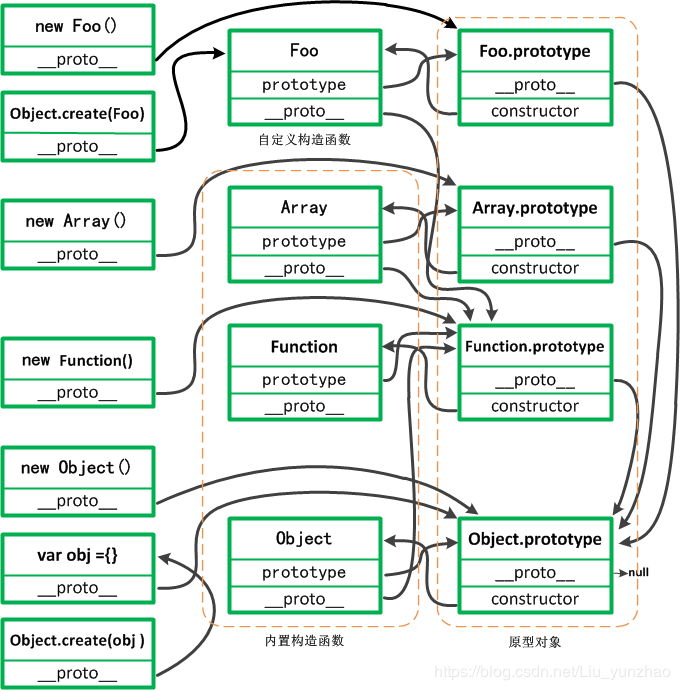
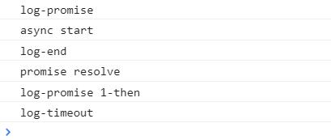
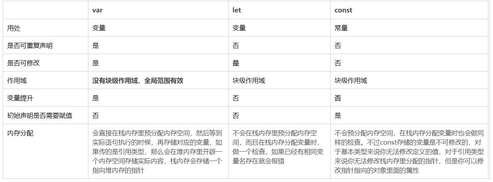
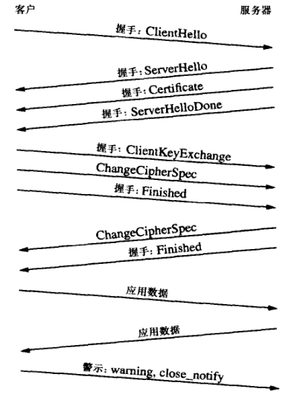
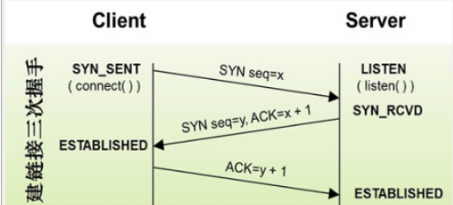
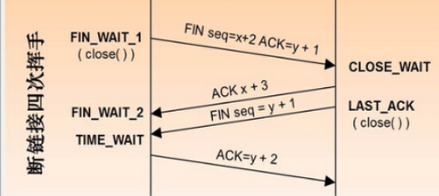
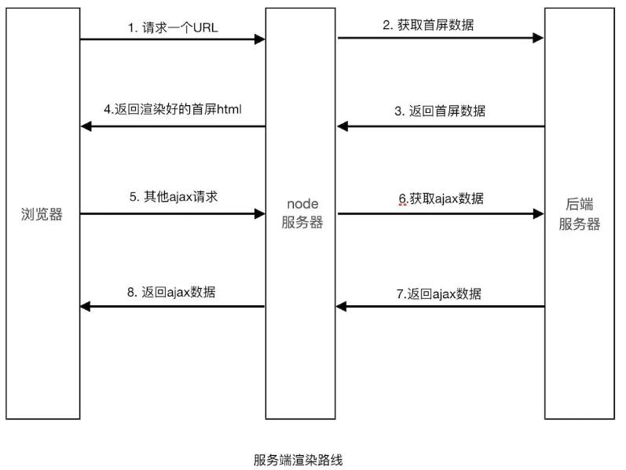
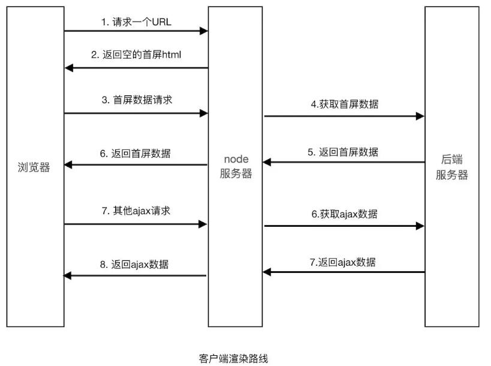
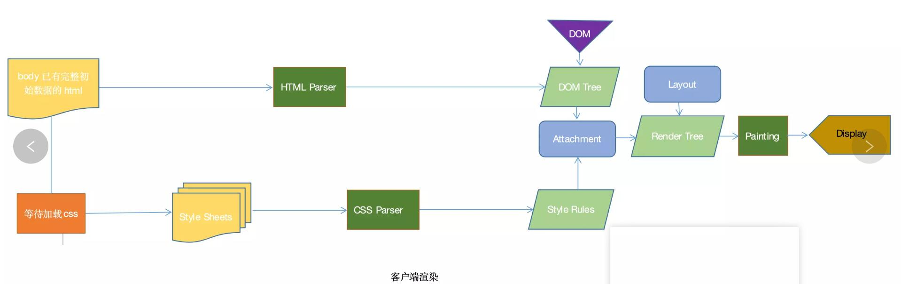
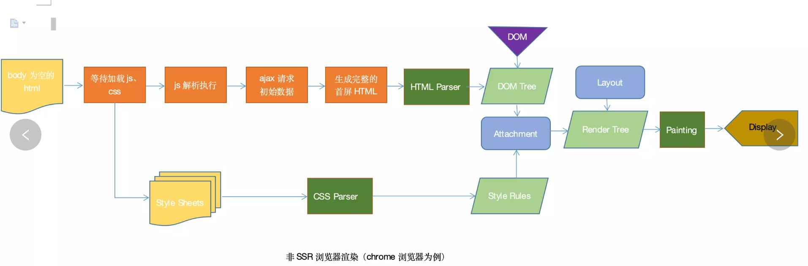

<!-- TOC -->

- [html](#html)
    - [meta头部作用](#meta头部作用)
    - [设备像素比dpr](#设备像素比dpr)
- [css](#css)
    - [清除浮动 （转笔记）](#清除浮动-转笔记)
    - [position属性](#position属性)
    - [BFC](#bfc)
    - [左右等高布局](#左右等高布局)
    - [两边定宽中间自适应布局](#两边定宽中间自适应布局)
    - [上下定高中间自适应布局](#上下定高中间自适应布局)
    - [高度保持宽度一致的布局](#高度保持宽度一致的布局)
    - [inline-block的缺陷](#inline-block的缺陷)
    - [rem，em](#remem)
    - [优先级](#优先级)
    - [css3](#css3)
        - [transform](#transform)
        - [translate](#translate)
        - [transition](#transition)
- [JavaScript](#javascript)
    - [DOM操作](#dom操作)
    - [原型链](#原型链)
        - [原型链的概念？](#原型链的概念)
        - [\_\_proto__和prototype](#\_\_proto__和prototype)
        - [Function对象，Object对象，function test(){}这三者之间**proto**和prototype的关系](#function对象object对象function-test这三者之间proto和prototype的关系)
    - [作用域](#作用域)
        - [作用域的概念？](#作用域的概念)
        - [作用域链的概念？](#作用域链的概念)
    - [继承（转笔记）](#继承转笔记)
    - [new过程](#new过程)
    - [函数的this指向](#函数的this指向)
    - [defineProperty](#defineproperty)
    - [事件代理机制](#事件代理机制)
        - [事件三个阶段及顺序（事件传播）](#事件三个阶段及顺序事件传播)
        - [阻止事件冒泡和默认事件](#阻止事件冒泡和默认事件)
        - [事件捕获](#事件捕获)
        - [事件委托/事件代理](#事件委托事件代理)
    - [事件循环机制](#事件循环机制)
        - [原理](#原理)
        - [实战](#实战)
    - [深复制和浅复制](#深复制和浅复制)
    - [函数式编程（未整理）](#函数式编程未整理)
        - [函数式编程思想](#函数式编程思想)
        - [纯函数](#纯函数)
        - [偏函数](#偏函数)
    - [内存溢出/内存泄露](#内存溢出内存泄露)
    - [基本类型](#基本类型)
        - [类型转换（转笔记）](#类型转换转笔记)
        - [12和12.0有什么区别](#12和120有什么区别)
        - [处理请求中的长整数](#处理请求中的长整数)
        - [jS类型判断的方法](#js类型判断的方法)
        - [typeof可以检测的值](#typeof可以检测的值)
        - [如何判断是否是数组](#如何判断是否是数组)
        - [如何判断空对象{}](#如何判断空对象)
- [es6](#es6)
    - [Es6扩展了哪些？](#es6扩展了哪些)
    - [箭头函数和普通函数的区别](#箭头函数和普通函数的区别)
    - [var，let，const区别](#varletconst区别)
    - [Proxy对象拦截什么（转笔记）](#proxy对象拦截什么转笔记)
    - [Reflect(转笔记)](#reflect转笔记)
    - [Promise（转笔记）](#promise转笔记)
    - [generator(未整理)](#generator未整理)
    - [数组内置方法](#数组内置方法)
- [跨域](#跨域)
    - [实现跨域的几种方式（转笔记）](#实现跨域的几种方式转笔记)
    - [实现jsonp,原理,缺点（转笔记）](#实现jsonp原理缺点转笔记)
    - [jsonp跨域有何危险（转笔记）](#jsonp跨域有何危险转笔记)
- [框架(vue)](#框架vue)
    - [vue原理](#vue原理)
        - [vue双向绑定原理(模板编译、依赖收集、发布订阅)](#vue双向绑定原理模板编译依赖收集发布订阅)
        - [nextTick（未整理）](#nexttick未整理)
    - [vue-router的实现](#vue-router的实现)
    - [vue设计模式 （未整理）](#vue设计模式-未整理)
    - [有哪些设计模式以及vue设计模式 （未整理）](#有哪些设计模式以及vue设计模式-未整理)
    - [vue封装组件（未整理）](#vue封装组件未整理)
    - [vue数组更新，数据未响应解决方案？](#vue数组更新数据未响应解决方案)
    - [Vue 如何监听一个不会触发 render 的数据(未整理)](#vue-如何监听一个不会触发-render-的数据未整理)
- [webpack](#webpack)
    - [loader和plugin的区别（未整理）](#loader和plugin的区别未整理)
    - [webpack打包文件名为什么要有hash值（未整理）](#webpack打包文件名为什么要有hash值未整理)
    - [webpack中的tree shaking](#webpack中的tree-shaking)
- [模块化](#模块化)
    - [Es6的模块和Require模块有什么不同](#es6的模块和require模块有什么不同)
- [设计模式](#设计模式)
    - [面向对象](#面向对象)
    - [对象](#对象)
- [网络](#网络)
    - [状态码](#状态码)
        - [哪种情况下会出现1开头](#哪种情况下会出现1开头)
    - [请求](#请求)
        - [http协议有哪些方法？](#http协议有哪些方法)
        - [options第一次预检后，后续是否会继续检查](#options第一次预检后后续是否会继续检查)
        - [get和post区别](#get和post区别)
        - [Ajax请求过程](#ajax请求过程)
        - [一个 TCP 连接中 HTTP 请求可以一起发送吗？](#一个 tcp 连接中 http 请求可以一起发送吗)
    - [http请求头](#http请求头)
        - [自定义HTTP请求头](#自定义http请求头)
    - [连接](#连接)
        - [实现长连接的几种方式](#实现长连接的几种方式)
    - [http缓存（转笔记）](#http缓存转笔记)
    - [http1.0 1.1 2.0,https](#http10-11-20https)
        - [1.1和2.0的区别](#11和20的区别)
        - [1.0和1.1的区别](#10和11的区别)
        - [http和https](#http和https)
        - [https如何保证安全 ，采用哪种加密方式](#https如何保证安全-采用哪种加密方式)
    - [网络协议](#网络协议)
        - [TCP和UDP区别](#tcp和udp区别)
        - [三次握手过程](#三次握手过程)
        - [tcp为什么要三次握手](#tcp为什么要三次握手)
        - [四次挥手过程](#四次挥手过程)
        - [为什么要四次挥手](#为什么要四次挥手)
        - [为什么要等待2MSL](#为什么要等待2msl)
        - [tcp如何保证可靠传输](#tcp如何保证可靠传输)
        - [DHCP 的实现基于啥协议（未整理）](#dhcp-的实现基于啥协议未整理)
    - [断点续传如何实现](#断点续传如何实现)
    - [不用ajax, 如何发送信息给服务器（未整理）](#不用ajax-如何发送信息给服务器未整理)
- [web安全](#web安全)
- [操作系统](#操作系统)
    - [进程和线程的区别](#进程和线程的区别)
    - [线程池的原理（未整理）](#线程池的原理未整理)
    - [死锁](#死锁)
        - [产生原因](#产生原因)
        - [死锁四个必要条件](#死锁四个必要条件)
        - [如何解决](#如何解决)
- [服务器](#服务器)
    - [nginx和apache的区别（未整理）](#nginx和apache的区别未整理)
- [浏览器](#浏览器)
    - [浏览器内核](#浏览器内核)
    - [怎么解决浏览器兼容性问题](#怎么解决浏览器兼容性问题)
- [正则](#正则)
    - [正则匹配手机](#正则匹配手机)
- [其它](#其它)
    - [微信扫码登录的原理？ （未整理）](#微信扫码登录的原理-未整理)
    - [精准设置时间](#精准设置时间)
    - [一个hello world的c语言程序编译到执行的过程。（未整理）](#一个hello-world的c语言程序编译到执行的过程未整理)
    - [软件性能在硬件上有哪些受限（未整理）](#软件性能在硬件上有哪些受限未整理)
    - [二维码功能是如何实现（未整理）](#二维码功能是如何实现未整理)
    - [对前端工程化的看法（未整理）](#对前端工程化的看法未整理)
- [综合](#综合)
    - [浏览器输入url到展示页面的过程](#浏览器输入url到展示页面的过程)
    - [前端性能优化的方法](#前端性能优化的方法)
        - [优化点](#优化点)
        - [如何做白屏优化（未整理）](#如何做白屏优化未整理)
        - [如何统计页面代码执行时间和性能分析（未整理）](#如何统计页面代码执行时间和性能分析未整理)
        - [如果能拿到页面所有的包括css渲染等的性能执行结果(所有用户), 你会用它来做什么（未整理）](#如果能拿到页面所有的包括css渲染等的性能执行结果所有用户-你会用它来做什么未整理)
    - [前端错误监控](#前端错误监控)
        - [为什么要前端错误监控](#为什么要前端错误监控)
        - [前端错误的分类](#前端错误的分类)
        - [即时运行错误的捕获方法](#即时运行错误的捕获方法)
        - [资源加载错误](#资源加载错误)
    - [编码压缩后如何定位生产环境的bug](#编码压缩后如何定位生产环境的bug)
        - [sourceMap](#sourcemap)
    - [如何设计一个前端router(未整理)](#如何设计一个前端router未整理)
- [场景题](#场景题)
    - [事件循环](#事件循环)
    - [原型链](#原型链-1)
    - [执行](#执行)
    - [实现双十一倒计时, 思路代码(未整理)](#实现双十一倒计时-思路代码未整理)
    - [请求大量数据前端怎么处理(待补充)](#请求大量数据前端怎么处理待补充)
    - [实现页面Tab点击切换](#实现页面tab点击切换)
    - [滚动加载（未整理）](#滚动加载未整理)
- [算法](#算法)
    - [贪心和分治（未整理）](#贪心和分治未整理)
    - [时间和空间复杂度为了优化什么](#时间和空间复杂度为了优化什么)
    - [](#)
- [项目难点](#项目难点)
- [知识点盲区](#知识点盲区)
    - [SSR](#ssr)
        - [](#-1)
    - [SPA（未整理）](#spa未整理)
    - [GraphQL（未整理）](#graphql未整理)
    - [TypeScript（未整理）](#typescript未整理)

<!-- /TOC -->


## 1. html

### 1.1 meta头部作用 

> 设置文档的元信息，让计算机更好理解该文档，以及提供一些程序指令，用于模拟HTTP首部

* `charset`：表示HTML文档中的内容所用的字符编码（推荐使用UTF-8），定义的属性不区分大小写。

  `<meta charset="UTF-8">` //html5写法

  `<meta http-equiv="content-type" content="text/html;charset=UTF-8"> `//传统写法

* `name`：表示文档级的元信息，定义的属性值不区分大小写，每个值对应特定的content属性值。name主要服务于计算机（如搜索引擎），让计算机更好的理解该文档。

  * application-name：Web应用的名字
  * author：文档的作者
  * description：文档内容的描述
  * generator：标识生成页面的工具名
  * keywords：定义文档的关键字，多个关键字用逗号隔开
  * robots，规定搜索引擎如何操纵该文档
  * viewport：主要用于移动设备，设置浏览器的视口。
    * width：视口宽度，（值：device-width或确切的像素值）
    * initial-scale：视口初始缩放级别（0~10的正数）
    * maximum-scale：视口能缩放的最大值（0~10的正数）
    * minimum-scale：视口能缩放的最小值（0-10）
    * user-scale：是否可以手动缩放（yes / no）

* `http-equiv`：提供一些程序指令，用于模拟HTTP首部，每个http-equiv属性值同样对应特定的content属性值。

  * content-type：定义MINE类型与字符编码，对应实体首部Content-Type，这个关键字已不推荐
  * default-style：指定样式表，值与样式表的title值一致。
  * refresh：指定一个以秒为单位的时间间隔，执行重载或重定向。
  * Set-Cookie: 如果网页过期，那么存盘的cookie将被删除。
  * content：name或http-equiv中设定的属性的值。

### 1.2 设备像素比dpr

devicePixelRatio = 物理像素 / 设备独立像素。

2代表1个css像素用2x2个设备像素来绘制。 


## 2. css

### 2.1 清除浮动 （转笔记）
* 见清除浮动的笔记
### 2.2 position属性

* static 
  * 默认布局。元素出现在正常的流中（忽略 top, bottom, left, right 或者 z-index 声明） 
* fixed
  *   生成固定定位的元素，相对于浏览器窗口进行定位。 
* relative
  * 不影响元素本身的属性（保持元素本身的块元素或内联元素的属性）
  * 不会使元素脱离文档流（元素原本位置会被保留，即改变位置也不会占用新位置） 
  * 没有定位偏移量时对元素无影响（相对于自身原本位置进行偏移） 
  * 提升层级（用z-index样式的值可以改变一个定位元素的层级关系，从而改变元素的覆盖关系，值越大越在上面，z-index只能在position属性值为relative或absolute或fixed的元素上有效。）  
* absolute
  * 使元素完全脱离文档流（在文档流中不再占位） 
  * 使内联元素在设置宽高的时候支持宽高（改变内联元素的特性） 
  * 使块元素在未设置宽度时由内容撑开宽度（改变块元素的特性） 
  * 相对于最近一个有定位的父元素偏移
  * 提升层级（同相对定位） 
* inheirt ： 会从父元素继承样式initial:默认样式
* sticky: 滚动时为超出指定区域，表现为relative, 否则表现为fixed 

### 2.3 BFC

* 含义
  * 块级格式化上下文，是一种布局方式。BFC盒子在所处的包含块内自顶部一个接一个垂直排列，水平方向撑满整个宽度。两个相邻BFC之间的距离由margin决定。在同一个BFC内部，两个垂直方向相邻的块级元素的margin会发生“塌陷”。通俗一点，可以把BFC理解为一个封闭的大箱子，箱子内部的元素无论如何翻江倒海，都不会影响到外部。 
* 原理
  * 在 BFC 的垂直方向上，边距会发生重叠
  * BFC 区域不会与 浮动区域重叠
  * BFC 在页面上是一个独立的容器，与其他元素互不影响
  * 计算 BFC 高度时，浮动元素也会参与计算 
* 创建
  * 根元素
  * float属性不为none
  * overflow不为visible(可以是hidden、scroll、auto)的块级元素
  * position为absolute或fixed
  * display为inline-block、flex、inline-flex、table-cell、table-caption ，
* 作用
  * `清除内部浮动`：我们在布局时经常会遇到这个问题：对子元素设置浮动后，父元素会发生高度塌陷，也就是父元素的高度变为0。解决这个问题，只需要把把父元素变成一个BFC就行了。常用的办法是给父元素设置overflow:hidden。 
  * `垂直margin合并`: 在CSS当中，相邻的两个盒子的外边距可以结合成一个单独的外边距。这种合并外边距的方式被称为折叠，并且因而所结合成的外边距称为折叠外边距。 
    * 两个相邻的外边距都是正数时，折叠结果是它们两者之间较大的值。
    * 两个相邻的外边距都是负数时，折叠结果是两者绝对值的较大值。
    * 两个外边距一正一负时，折叠结果是两者的相加的和。 
  * `创建自适应两栏布局`: 图片设置float后，兄弟元素文字就会环绕图片，给文字加overflow:hidden就可以实现左右两栏布局。

### 2.4 左右等高布局

* `flex`: 父元素设置display:flex就可以。因为侧轴Flex项目默认是align-items：stretch;

  ```css
  #container{
      display: flex;
  } 
  ```

* `负margin与正padding`

  ```css
  #container {
      overflow: hidden;
  }
  
  #left,#right {
      float: left;
      padding-bottom: 5000px;
      margin-bottom: -5000px;
  }
  ```

* `table-cell`

  ```css
  #container{
      display: table;
  } 
  #left,#right{
      display: table-cell;
  }
  ```

  

### 2.5 两边定宽中间自适应布局

```css
/* flex html:left -> main -> right*/
 #box{
    display: flex;
    height: 300px;
}

#left,#right{
    width:100px;
}

#main{
    flex:1;
}
```
```css
/*calc  html:left -> main -> right*/
#box {
    font-size: 0;
}
#box>div{
    height: 300px;
    display: inline-block;

}

#left,#right {
    background-color: tomato;
    width: 100px;
}

#main {
    background-color: teal;
    width: calc(100% - 200px);
}
```
```css
/*float  html:left -> right -> main*/
#box > div {
    height: 300px;
}

#left {
    background-color: tomato;
    width: 100px;
    float: left;
}

#right {
    background-color: tomato;
    width: 100px;
    float: right;
}

#main {
    background-color: teal;
    margin:0 100px;
}
```
```css
#box {
    position: relative;
}

#box>div {
    height: 300px;
}

#left,
#right {
    background-color: tomato;
    width: 100px;
    position: absolute;
    top: 0;
}

#left {
    left: 0;
}

#right {
    right: 0
}

#main {
    background-color: teal;
    margin:0 100px;
}
```

```css
html, body {
    height: 100%;
}

#box {
    height: 100%;
    display:grid;
    /*分别对应每个子元素的高度*/
    grid-template-columns:100px calc(100% - 200px) 100px;
    /*分别对应每个子元素的宽度*/
    grid-template-rows:100%
}
```


### 2.6 上下定高中间自适应布局

```css
页面结构：top -> main -> bottom
html,body{
    height: 100%;
}
#container{
    height: 100%;
}
#top,#bottom{
    height: 100px;
}
#main{
    height: calc(100% - 200px);
}
```


```css
页面结构：top -> main -> bottom
html,body{
    height: 100%;
}
#container{
    height: 100%;
    display: flex;
    flex-direction: column;
}
#top,#bottom{
    height: 100px;
}
#main{
    flex: 1;
}

```

```css
html, body {
    height: 100%;
}

#container {
    height: 100%;
    position: relative;
}

#top, #bottom, #main {
    /*这句很重要，因为绝对定位布局将块级元素改为由内容撑开*/
    width: 100%;
    position: absolute;
    left: 0;
}
#top, #bottom {
    height: 100px;
}

#top {
    top: 0;
}
#bottom {
    bottom: 0;
}
#main {
    position: absolute;
    top: 100px;
    bottom: 100px;
}
```

```css
html, body {
    height: 100%;
}

#container {
    height: 100%;
    display:grid;
    /*分别对应每个子元素的高度*/
    grid-template-rows:100px calc(100% - 200px) 100px;
    /*分别对应每个子元素的宽度*/
    grid-template-columns:100%
}
```

### 2.7 高度保持宽度一致的布局

```js
//方法1：padding-bottom + height:0;
//父元素需要设置宽高
.child {
    width: 100%;
    padding-bottom: 100%;
    height: 0; //很重要：不加height: 0 高度就是实际内容的高度 + padding的高度
}
```

### 2.8 inline-block的缺陷 

元素之间会有间隙。这是由于在编写HTML文档的时候，为了便于阅读，通常会将结构格式化。格式化话后的代码就会包含换行符，还会包含空白符，浏览器会将这些额外的字符合并成一个空白符。

解决方法：

* 在父元素的div中定义css的font-size为0；
* 将几个元素写在一行。
* 给父元素div定义负的letter-spacing，减少字符之间的间距，再把span元素的letter-spacing定义为0，清除间距。 

### 2.9 rem，em 

* rem参照的根元素的字体大小
* em参照的是父元素的字体大小

### 2.10 优先级

* 内联元素：1,0,0,0
* id：0,1,0,0
* class,伪类：0,0,1,0
* 标签，伪元素：0,0,0,1

比较规则

* 先从高等级进行比较，高等级相同时，再比较低等级的，以此类推；
* 完全相同的话，就采用 后者优先原则（也就是样式覆盖）；
* css属性后面加 !important 时，无条件绝对优先（比内联样式还要优先）；
* **低等级的选择器，个数再多也不会越等级超过高等级的选择器的优先级的**; 即10个class不会与1个id等价

### 2.11 css3

#### 2.11.1 transform

变形。包括

旋转：rotate() 顺时针旋转给定的角度，允许负值 rotate(30deg) 

扭曲：skew() 元素翻转给定的角度,根据给定的水平线（X 轴）和垂直线（Y 轴）参数：skew(30deg,20deg) 

缩放：scale() 放大或缩小，根据给定的宽度（X 轴）和高度（Y 轴）参数： scale(2,4) 

移动：translate() 平移，传进 x,y值，代表沿x轴和y轴平移的距离 

改变起点位置 transform-origin: bottom left; 

#### 2.11.2 translate

移动。transform的一个方法。通过 translate() 方法，元素根据给定的 left（x 坐标） 和 top（y 坐标）从其当前位置移动。 

#### 2.11.3 transition

允许CSS属性值在一定的时间区间内平滑的过渡。需要事件的触发，例如单击、获取焦点、失去焦点等 

 transition:property duration timing-function delay; 

* property:CSS的属性，例如：width height 为none时停止所有的运动，可以为transform 。当property为all的时候所有动画 
* duration:持续时间
* timing-function:ease等
* delay:延迟

## 3. JavaScript

### 3.1 DOM操作

* 查找
  * 按id查找节点：document.getElementById('id'); 
  * 按标签名查找节点: document.getElementByTagName('div'); 
  * 按name查找节点：document.getElmentByName('name');
  * 按类名查找节点：document.getElementByClassName ('className');
  * 返回匹配指定选择器的第一个元素 : document.querySelector('#id');
    * 选择器可以使用它们的 id, 类, 类型, 属性, 属性值等来选取元素。 
  * 返回匹配指定选择器的所有元素：document.querySelectorAll(‘.className  div’); 
  * 查找父节点: node.parentNode;  
  * 查找孩子节点（不包括后代）: node.children; 
* 创建
  * 创建节点：document.createElement('tagName');
  * 复制节点：node.cloneNode(true/false) 克隆节点;
* 插入
  * 在节点内部的末尾插入：node.appendChild(新节点) ;
  * 在parent的孩子(已知节点)前插入元素: parent.insertBefore(新的节点，已知节点) ;
  * 将节点的孩子替换成新的节点：node.replaceChild(新节点) ;
* 属性
  * 获取节点class列表：node.classList;
  * 增加节点class：node.classList.add(‘新的class’) ;
  * 删除节点class ： node.classList.remove('需要删除的class') ;
  * 判断节点是否存在某个class： node.classList.contains(‘某个class的名称’) ;
  * 切换节点class — node.classList.toggle('需要切换的class') ；
  * 直接赋值className: node.className = 'className'；
  * 修改style: node.style.xxx = xx;
  * 获取节点某个属性的属性值: node.getAttribute('需要获取的属性名')；
  * 设置节点某个属性的属性值: node.setAtrribute(‘’属性名,'新的属性值'); 
  * 删除节点的某个属性: node.removeAttribute('需要删除的属性名') 
  * 获取节点的属性对象数组：node.attributes;

### 3.2 原型链

#### 3.2.1 原型链的概念？
> 对象之间通过原型关联到一起，就好比用一条链将一个个对象连接在一起，在与多个对象挂钩后，形成一条原型。当在某一个对象内部查找某个属性或方法时，会先在当前对象内部进行查找，没有的话就沿着原型链一级一级向上查找，找到则返回，直到达到原型链的顶端才停止搜索，原型链的顶端是**Object.prototype**。原型链是在创建的时候就确定的。

#### 3.2.2 \_\_proto__和prototype

>  区别及联系？用代码说明

- typeof === 'object'的除了null都有\__proto__
- typeof === 'function'的都有prototype

```
function Animal(){

}
let a = new Animal();
console.log(a.__proto__ === Animal.prototype);//true
```

#### 3.2.3 Function对象，Object对象，function test(){}这三者之间**proto**和prototype的关系

- Object.prototype.\__proto__ === null;
- Function.prototype.\__proto__ === Object.prototype;
- Object.\_\_proto\_\_ === Function.prototype === Function.\__proto__
- Math, JSON的\__ptoto__是 Object.prototype
- function test(){}这样创建出来，没有继承关系的函数。test.prototype.\_\_proto\_\_ === Object.prototype
- 有继承关系的function看上面的推断
- 对象字面量和new Object() 比如， var a ={}, b = new Object(), c = [];
  - a._\_proto__ === a.constructor.prototype === Object.prototype
- 基本数据类型string,number,boolean,比如 var a = '', b=10, c= false，
  - b._\_proto__ === b.constructor.prototype === Number.prototype
  - b.\_\_proto\_\_.\_\_proto\_\_ === Number.prototype.\_\_proto\_\_ === Object.prototype
- null和undefined没有\__proto__




### 3.3 作用域

#### 3.3.1 作用域的概念？
    作用域是在运行时代码中的某些特定部分的变量，函数和对象的可访问性。也就是作用域决定了代码块中变量和其他资源的可见性。
#### 3.3.2 作用域链的概念？
    每个对象内部都有一个内部属性[[scope]]，这个内部属性包含了函数被创建的作用域中的对象的集合，这个集合被称为函数的作用域链。
### 3.4 继承（转笔记）

### 3.5 new过程

1. 新生成一个对象 
2. 链接到原型 
3. 绑定this到新创建的对象，执行构造函数中的代码 
4. 返回新对象 

```js
function _new(fn) {
  //创建一个对象，该对象的隐式原型指向fn的原型对象
  const obj = Object.create(fn.prototype);
  //绑定this，将函数中的this指向obj
  const res = fn.apply(obj, [...arguments].slice(1));
  //如果传入参数中的构造函数执行后的res是对象类型,那么这个对象会取代obj作为返回的对象
  if ((typeof res === "object" || typeof res === "function") && res !== null) {
    return res;
  }
  return obj;
}
```

### 3.6 函数的this指向

* `function`：this对象是在运行时基于函数的执行环境绑定的。全局函数中this等于window，当函数作为某个对象的方法调用时，this等于那个对象。
* `匿名函数`: 匿名函数的执行环境具有全局性，因此this对象指向window。
* `setTimeout`: this对象指向window
* `箭头函数`：定义时所在的对象 。箭头函数没有自己的this，内部的this就是外层代码块的this。

### 3.7 defineProperty
> `Object.defineProperty()`的作用就是直接在一个对象上定义一个新属性，或者修改一个已经存在的属性。

* `Object.defineProperty(obj, prop, desc)`。 obj为对象，prop为需要定义的属性名，desc为属性描述符。
    * configurable: false 时，不能删除当前属性，且不能重新配置当前属性的描述符(有一个小小的意外：可以把writable的状态由true改为false,但是无法由false改为true),但是在writable: true的情况下，可以改变value的值
    * configurable: true时，可以删除当前属性，可以配置当前属性所有描述符。
    * 如果writable为false不能通过赋值的形式修改属性值，如果此时configurable为true那么可以通过属性定义（defineProperty）的方式修改属性值。
```js
let Person = {}
Object.defineProperty(Person, 'name', {
   value: 'hsl',
   enumerable:false,//是否可枚举
   configurable:false,//是否可配置。
   writable: true, // 是否可以改变，设置为false时不能通过赋值形式修改value。
   
   get:function(){

   },
   set:function(){

   }

})
```

### 3.8 事件代理机制
#### 3.8.1 事件三个阶段及顺序（事件传播）
1. 捕获阶段：事件从文档根元素开始逐层向下传递，直到事件的目标
2. 目标阶段：找到事件目标并触发相应的事件
3. 冒泡阶段：从目标逐级向上返回到根节点
#### 3.8.2 阻止事件冒泡和默认事件
1. 阻止事件冒泡
    * w3c是e.stopPropagation()，ie下是window.event.cancelBubble = true。
    * window.event? window.event.cancelBubble = true : e.stopPropagation();
2. 阻止默认事件
    * w3c的方法是e.preventDefault()，IE则是使用e.returnValue = false;
    * window.event? window.event.returnValue = false : e.preventDefault();
    
#### 3.8.3 事件捕获
通俗的理解就是，当鼠标点击或者触发dom事件时，浏览器会从根节点开始`由外到内`进行事件传播，即点击了子元素，如果父元素通过事件捕获方式注册了对应的事件的话，会先触发父元素绑定的事件。

#### 3.8.4 事件委托/事件代理
* 时间委托又称事件代理：将子类（元素）需要执行的方法绑定到父元素(祖先)上，由父元素执行这个方法
* 原理：事件委托是利用事件的冒泡原理来实现的，何为事件冒泡呢？就是事件从最深的节点开始，然后逐步向上传播事件，举个例子：页面上有这么一个节点树，div>ul>li>a; 比如给最里面的a加一个click点击事件，那么这个事件就会一层一层的往外执行，执行顺序a>li>ul>div，有这样一个机制，那么我们给最外面的div加点击事件，那么里面的ul，li，a做点击事件的时候，都会冒泡到最外层的div上，所以都会触发，这就是事件委托，委托它们父级代为执行事件。
* 作用：
    * 如：一个ul里很多li，他们需要绑定相同的时事件，如果不用事件委托，需要为每个li绑定事件，如果采用了事件委托则应该只需要给ul绑定事件，提升了性能。
    * 同样可以用在为ul绑定事件的时候获取目标节点
    ```js
    window.onload = function(){
    　　var oUl = document.getElementById("ul1");
    　　oUl.onclick = function(ev){
    　　　　var ev = ev || window.event;
    　　　　var target = ev.target || ev.srcElement;
    　　　　if(target.nodeName.toLowerCase() == 'li'){
　　　　　　　  alert(target.innerHTML);
    　　　　}
    　　}
    }
    ```
    * 事件委托机制可以响应动态新增的节点，因为绑定事件的是ul，新增的元素同样具有冒泡事件。但是如果不用事件委托机制，新增的元素需要额外的绑定事件。


### 3.9 事件循环机制
#### 原理

js的单线程，只有一个主线程负责解释执行js代码。由于单线程原因，同一时间只能处理一个任务，其余的任务需要排队等候并且只能按顺序来，中间不能插队。所以一旦有一个任务很长，后面的任务都会推迟执行。
这些任务分为同步任务和异步任务，同步任务会率先被执行，而异步任务会先到任务队列中排队。

* 同步任务
    * 同步任务都在主线程中执行，发出调用后，调用者被阻塞，直到调用完成，才能得到预期效果
* 异步任务
    * 一旦执行栈中的所有同步任务执行完毕（此时JS引擎空闲），系统就会读取任务队列，将可运行的异步任务添加到可执行栈中，开始执行。
* js通过事件循环机制高效的处理多个任务，是通过任务队列机制来协调的。
  * 任务分类

    * 宏任务（macro task）：每次执行栈执行的代码就是一个宏任务（包括每次从事件队列中获取一个事件回调并放到执行栈中执行）。浏览器为了能够使得JS内部(macro)task与DOM任务能够有序的执行，会在一个(macro)task执行结束后，在下一个(macro)task 执行开始前，对页面进行重新渲染。script(整体代码)、setTimeout、setInterval、I/O、UI交互事件、postMessage、MessageChannel、setImmediate(Node.js 环境)

    * 微任务（micro task）： 当前 task 执行结束后立即执行的任务。 也就是说，在当前task任务后，下一个task之前，在渲染之前。 所以它的响应速度相比setTimeout（setTimeout是task）会更快，因为无需等渲染。 在某一个macrotask执行完后，就会将在它执行期间产生的所有microtask都执行完毕（在渲染前）。microtask主要包含：Promise.then，MutaionObserver，process.nextTick。
  * 运行机制

    * 执行一个宏任务（栈中没有就从事件队列中获取）

    * 执行过程中如果遇到微任务，就将它添加到微任务的任务队列中
    * 宏任务执行完毕后，立即执行当前微任务队列中的所有微任务（依次执行）
    * 当前宏任务执行完毕，开始检查渲染，然后GUI线程接管渲染
    * 渲染完毕后，JS线程继续接管，开始下一个宏任务（从事件队列中获取）
  * Promise和async中的立即执行

    * Promise中的异步体现在then和catch中，所以写在Promise中的代码是被当做同步任务立即执行的。

    * 而在async/await中，在出现await出现之前，其中的代码也是立即执行的。
    * 实际上await是一个让出线程的标志。await后面的表达式会先执行一遍，将await后面的代码加入到microtask中，然后就会跳出整个async函数来执行后面的代码。

####  实战

```js
setTimeout(()=>{
    console.log('log-timeout');
},0);
const promise = new Promise((resolve)=>{
    console.log('log-promise');
    resolve('promise resolve');
})
fn = async  ()=>{
    console.log('async start');
    const str = await promise;
    console.log(str);
}
fn();
promise.then(()=>{
    console.log('log-promise 1-then');
});
console.log('log-end')
```





### 3.10 深复制和浅复制

- 浅拷贝就是将一个对象（或数组）的内存地址『编号』复制给另一个对象（或数组）。理解为浅拷贝只复制指向某个对象的指针，而不复制对象本身，新旧对象还是共享同一块内存。
- 深拷贝就是增加一个指针，并且申请一个新的内存地址，使这个增加的指针指向这个新的内存，然后将原变量对应内存地址里的值逐个复制过去。深拷贝会另外创造一个一模一样的对象，新对象跟原对象不共享内存，修改新对象不会改到原对象
- js实现深拷贝的几种方式
    - 数组：//注意这种方法只能复制一层，二层还是浅拷贝
        - `let b = a.slice(0);`
        - `let b = [].concat(a);`
    - 对象
        - let b = JSON.parse(JSON.stringify(a));

          存在缺陷

          - 会忽略undefined
          - 会忽略symbol
          - 不能序列化函数
          - 不能解决循环引用的对象 
    ```js
    //正确方法
    function deepCopy(obj) {
        if (obj instanceof Array){
            let temp = [];
            obj.forEach(function(item,index) {
                temp[index] = deepCopy(item);
            })
            return temp;
        }else if(obj instanceof Object) {
            let temp = {};
            for(let key in obj){
                temp[key] = deepCopy(obj[key])
            }
            return temp;
        }else{
            return obj;
        }
    }
    
    //改造一下写法
     function deepCopy(obj) {
         if (typeof obj === 'object' && obj !== null) {
             let temp;
             if (obj instanceof Array) {
                 temp = [];
             } else if (obj instanceof Object) {
                 temp = {};
             }
             for (let key in obj) {
                 temp[key] = deepCopy(obj[key])
             }
             return temp;
         }
         return obj;
     }
    ```

### 3.11 函数式编程（未整理）

#### 3.11.1 函数式编程思想


#### 3.11.2 纯函数


#### 3.11.3 偏函数 

### 3.12 内存溢出/内存泄露

* 内存泄露

  > 程序在申请内存后，无法释放已申请的内存空间，一次内存泄露危害可以忽略，但内存泄露堆积后果很严重，无论多少内存,迟早会被占光。最终可能造成内存溢出 

  > 1. 给DOM添加点击方法、添加属性等，也会造成变量引用得不到释放，造成内存泄漏。 
  > 2. 闭包: 内部的变量因为被闭包引用得不到释放，也会造成内存泄漏。
  > 3. 计时器、回调、监听等事件没有移除：

  ```js
  function fn() {
      let count = 0;
      return function () {
          count++;
      }
  }
  let add = fn();
  ```

  

* 内存溢出

  > 溢出是指程序在申请内存时，没有足够的内存空间供其使用 

  > 1. 最简单的就是写一个千万级别的循环，然后用浏览器打开，浏览器会非常卡，甚至直接报错内存不足，崩溃了。不同浏览器会有不同的表现。
  > 2. 内存溢出一般是内存泄漏造成的，占用的内存不需要用到了但是没有及时释放，内存泄漏积累的多了轻的话影响系统性能，严重直接引起内存溢出系统崩溃

  ```js
  let arr = [];
  while (true) {
      arr.push(1);
  }
  ```

  

  


### 3.13 基本类型

#### 3.13.1 类型转换（转笔记）
* 见印象笔记类型转换笔记
#### 3.13.2 12和12.0有什么区别

12是整数，12.0是浮点数

* 浮点数有时并不能准确的转换为二进制数。因此，内部进行二进制运算时会有精度误差 
* 解决：
  * 用JS提供的最小精度：`Math.abs(0.1 + 0.2 - 0.3) <= Number.EPSILON;` //true
  * 保留小数位数：`parseFloat((0.1 + 0.2).toFixed(10)) === 0.3;` // true 

#### 3.13.3 处理请求中的长整数
- Javascript的数字存储使用了IEEE 754中规定的双精度浮点数数据类型，而这一数据类型能够安全存储 -(2^53 - 1) 到 2^53 - 1 之间的数值（包含边界值）。
- 所以当后台传了一个64位的长整数时，会发生精度丢失问题。
- 解决：
    - 后台传到前台时，Long类型数据，转为String类型。

    - 在网上看到一种方案：使用json-bigint 

      -  基本原理---是接收到后台传递的数据后在解析数据的时候使用 json-bigint 代替json去解析 

      - 但我用mock.js模拟请求，结果还是不能保留原本的数据，不知道是不是mock.js返回的数据在发送时就已经有精度问题了。所以这种方案我也不知道对错。

        ```js
        axios({
         method: method,
         url: url,
         data: data,
         // transformResponse 在传递给 then/catch 前，允许修改响应数据
         transformResponse:[function(data){
             return JSONbig.parse(data)
         }]
         }).then(function (ret) {
         	console.log(ret)
         }).catch(function (err) {
         	console.log(err)
         })
        ```

        

####  3.13.4 jS类型判断的方法

* typeof a
* a  instanceof Array
* Object.toString.call(a)

#### 3.13.5 typeof可以检测的值

number，boolean，string，undefined，function，object，symbol，bigint。

#### 3.13.6 如何判断是否是数组 

1. ` console.log(Array.isArray(obj)); `
2. `console.log(Object.prototype.toString.call(obj) === '[object Array]') ;`
3. `console.log(Array.prototype.isPrototypeOf(obj));`
   * 如果obj不是数组但是原型被绑定到了Array上（obj.\_\_proto\_\_ = []），则同样会输出true;
4. `console.log(arr instanceof Array); `
   * 如果obj不是数组但是原型被绑定到了Array上（obj.\_\_proto\_\_ = []），则同样会输出true;

#### 3.13.7 如何判断空对象{}

1. `JSON.stringify(obj) === '{}' `
2. `Object.keys(obj).length === 0`
3. `Object.values(obj).length === 0`
4. `Object.entries(obj).length === 0`   //entries返回对象键值对组成的数组，如[["name", "hh"] ,["age",22]]


## 4. es6

### 4.1 Es6扩展了哪些？

* 数值扩展

* 函数扩展

* Proxy

* Reflect

* Promise

* class

* 生成器函数

* async/await

  

### 4.2 箭头函数和普通函数的区别 

* 箭头函数是匿名函数，不能作为构造函数，不能使用`new`
* 箭头函数没有原型属性
* 箭头函数不能当做`generator`函数，不能使用`yield`关键字。
* 箭头函数不能绑定`arguments`,取而代之用`rest`参数...解决
* 箭头函数没有自己的this, 它的this是继承而来; 默认指向在定义它时所处的对象(宿主对象),而不是执行时的对象, 定义它的时候,可能环境是window;,
* 任何方法都改变不了其指向，如`call()`,`apply()`,`bind()`

### 4.3 var，let，const区别

* let和const在定义之前是不能被使用的，因为虽然变量也会被提升，但是提前声明的变量都在临时性死区中，不能使用；
* const 和 let 声明的变量不在 window 无法通过window.xx获取变量

### 4.4 Proxy对象拦截什么（转笔记）

get，set,deleteProperty,has,getPrototypeOf,defineProperty,......,共13个。

### 4.5 Reflect(转笔记)

### 4.6 Promise（转笔记）

### 4.7 generator(未整理)


### 4.8 数组内置方法

| 方法 | 是否修改原数组 |返回|
| ---------------- | ------------ | ------------------------------------------------------------ |
| splice()         | 是  | arrayObject.splice(index,howmany,item1,.....,itemX)  <br>howmany: 必需。要删除的项目数量。如果设置为 0，则不会删除项目。<br>返回：以数组的形式返回被删除的元素 |
| reverse()        | 是   | 返回修改后的数组，和原数组指向同一内存空间                                            |
| slice(start,end) | 不 | 返回从 start 到 end （不包括该元素）的 arrayObject 中的元素。 |
|concat()| 不 | 返回被连接数组的一个副本|
|toString()| 不 | 返回值与没有参数的 join() 方法返回的字符串相同 |
| fill(v,start,end) | 是 | 返回用value从start到end填充的数组(默认所有位置)|
|map(func)|不|返回按指定规则处理后的数组|
|reduce(func) |不|返回最终计算的值|
|filter(func)|不|返回过滤后的数组|
|find(func)|不|返回通过测试(函数判断)的数组的第一个元素的值，没有符合则返回undefined|
|includes(item)|不|检测数组中是否包括item,有就返回true,没有就返回false|
|some (func)|不|判断数组中是否有符合func条件的元素，如果有一个元素符合则会终止循环返回true,否则返回false|
|every(func)|不|判断数组中所有元素是否符合func条件，如果有一个元素不符合则会终止循环返回false,否则返回true|

* forEach和map的区别
  * 返回值：forEach()返回的是undefined，map()返回的是新的数组
  * 原数组：forEach()的原数组会根据函数的执行进行改变，map()原数组不会变
* 没有办法终止跳出forEach()循环，除非抛出异常

## 5. 跨域

### 5.1 实现跨域的几种方式（转笔记）

### 5.2 实现jsonp,原理,缺点（转笔记） 

### 5.3 jsonp跨域有何危险（转笔记） 

## 6. 框架(vue)

### 6.1 vue原理 

#### 6.1.1 vue双向绑定原理(模板编译、依赖收集、发布订阅)

* 主要是通过`Object`对象的`defineProperty`属性，重写data的`set`和`get`函数来实现的

* 数据劫持+发布者-订阅者的方式。通过Object.defineProperty()来劫持各个属性的setter和getter。在数据变动时发布消息给订阅者，触发相应的监听回调。当Vue实例被创建时，vue会遍历data中绑定的数据性，用Object.defineProperty将他们转化为setter和getter，用户看不到 getter/setter，但是在内部它们让 Vue 追踪依赖，在属性被访问和修改时通知变化。每个组件实例都有相应的watcher程序实例，它会在组件渲染的过程中吧属性记录为依赖，之后当依赖项的setter被调用时，会通知watcher重新计算，从而使它关联的组件得以更新。

  vue的数据双向绑定 将MVVM作为数据绑定的入口，整合Observer，Compile和Watcher三者。

  * 实现一个监听者Oberver来劫持并监听所有的属性，一旦有属性发生变化就通知订阅者 
  * 实现一个解析器compile，可以扫描和解析每个节点的相关指令（ {{}}，v-model,......），并根据初始化模板数据以及初始化相对应的订阅者 
  * 实现一个订阅者watcher搭起observer和Compile之间的通信桥梁，来接受属性变化的通知并执行相应的方法，达到数据变化 —>视图更新；视图交互变化（input）—>数据model变更双向绑定效果。 

  


#### 6.1.2 nextTick 

* 应用场景

  * 在Vue生命周期的`created()`钩子函数进行的DOM操作一定要放在`Vue.nextTick()`的回调函数中 
    * 在`created()`钩子函数执行的时候DOM 其实并未进行任何渲染，而此时进行DOM操作无异于徒劳，所以此处一定要将DOM操作的js代码放进`Vue.nextTick()`的回调函数中。与之对应的就是`mounted()`钩子函数，因为该钩子函数执行时所有的DOM挂载和渲染都已完成，此时在该钩子函数中进行任何DOM操作都不会有问题 。 
  * 在数据变化后要执行的某个操作，而这个操作需要使用随数据改变而改变的DOM结构的时候，这个操作都应该放进`Vue.nextTick()`的回调函数中。 

* 原理

  官方：Vue 异步执行 DOM 更新。只要观察到数据变化，Vue 将开启一个队列，并缓冲在同一事件循环中发生的所有数据改变。如果同一个 watcher 被多次触发，只会被推入到队列中一次。这种在缓冲时去除重复数据对于避免不必要的计算和 DOM 操作上非常重要。然后，在下一个的事件循环“tick”中，Vue 刷新队列并执行实际 (已去重的) 工作。Vue 在内部尝试对异步队列使用原生的 `Promise.then` 和`MessageChannel`，如果执行环境不支持，会采用 `setTimeout(fn, 0)`代替。 

  * 例如，当你设置`vm.someData = 'new value'`，该组件不会立即重新渲染。当刷新队列时，组件会在事件循环队列清空时的下一个“tick”更新。多数情况我们不需要关心这个过程，但是如果你想在 DOM 状态更新后做点什么，这就可能会有些棘手。虽然 Vue.js 通常鼓励开发人员沿着“数据驱动”的方式思考，避免直接接触 DOM，但是有时我们确实要这么做。为了在数据变化之后等待 Vue 完成更新 DOM ，可以在数据变化之后立即使用`Vue.nextTick(callback)` 。这样回调函数在 DOM 更新完成后就会调用。 

### 6.2 vue-router的实现

前端路由是直接找到与地址匹配的一个组件或对象并将其渲染出来。改变浏览器地址而不向服务器发出请求 。

有两种方式:

* `hash模式`：在地址中加入`#`以欺骗浏览器，地址的改变是由于正在进行页内导航
* 使用H5的`window.history`功能，使用URL的Hash来模拟一个完整的URL。

模式比较

* 调用history.pushState()相比于直接修改hash主要有以下优势： 
  * pushState设置的新url可以是与当前url同源的任意url, 而hash只可修改#后面的部分，故只可设置与当前同文档的url。
  * pushState设置的新url可以与当前url一模一样，这样也会把记录添加到栈中，而hash设置的新值必须与原来不一样才会触发记录添加到栈中
  * pushState通过stateObject可以添加任意类型的数据记录中，而hash只可添加短字符串
  * pushState可额外设置title属性供后续使用

history的问题：

* 对于单页应用来说，理想的使用场景是仅在进入应用时加载index.html，后续在的网络操作通过ajax完成，不会根据url重新请求页面，但是如果用户直接在地址栏中输入并回车，浏览器重启重新加载等特殊情况。		hash模式仅改变hash部分的内容，而hash部分是不会包含在http请求中的(hash带#)：  如请求http://oursite.com/#/user/id，只会发送http://oursite.com。 所以hash模式下遇到根据url请求页面不会有问题。而history模式则将url修改的就和正常请求后端的url一样(history不带#) http://oursite.com/user/id。如果这种向后端发送请求的话，后端没有配置对应/user/id的get路由处理,会返回404错误。
* 官方推荐的解决办法是在服务端增加一个覆盖所有情况的候选资源：如果 URL 匹配不到任何静态资源，则应该返回同一个 index.html 页面，这个页面就是你 app 依赖的页面。同时这么做以后，服务器就不再返回 404 错误页面，因为对于所有路径都会返回 index.html 文件。为了避免这种情况，在 Vue 应用里面覆盖所有的路由情况，然后在给出一个 404 页面。或者，如果是用 Node.js 作后台，可以使用服务端的路由来匹配 URL，当没有匹配到路由的时候返回 404，从而实现 fallback。

### 6.3 vue设计模式 （未整理）

### 6.4 有哪些设计模式以及vue设计模式 （未整理）
> 具体问了装饰器和观察者，包括和别的模式的差别和应用

### 6.5 vue封装组件（未整理）

### 6.6 vue数组更新，数据未响应解决方案？

Vue 不能检测以下数组的变动：

- 当你利用索引直接设置一个数组项时，例如：vm.items[indexOfItem] = newValue;
- 当你修改数组的长度时，例如：vm.items.length = newLength;

解决方案

* Vue.set(vm.items, indexOfItem, newValue)；
* vm.items.splice(indexOfItem, 1, newValue)；
* vm.items.splice(newLength) ;

### 6.7 Vue 如何监听一个不会触发 render 的数据(未整理) 


## 7. webpack

### 7.1 loader和plugin的区别（未整理）

### 7.2 webpack打包文件名为什么要有hash值（未整理） 

* 简单理解就是版本控制，打包出来的每个版本hash不一致避免线上资源引用错误 

### 7.3 webpack中的tree shaking 

tree shaking (摇树优化)

* 主要作用：打包项目时会将不用到的方法不打包入项目中，这样得以优化项目体积 
* 消除哪些代码？
  * 代码不会被执行，不可到达
  * 代码执行的结果永远不会被用到
  * 代码只会影响死变量（只写不读）；
* 实现原理
  * 基于es6的静态引用，tree shaking 通过扫描所有的es6的 export，找出被import 的内容并添加到最终代码中，webpack的实现是把所有import标记为有使用／无使用两种，在后续压缩时进行区别处理 
* 使用
  * webpack配置中的wbpack.prod.js中只需要设置 `mode:'production'` 生产模式中tree shaking默认开启。

## 8. 模块化

### 8.1 Es6的模块和Require模块有什么不同 

* import是ES6标准中的模块化解决方案，require是node中遵循CommonJS规范的模块化解决方案 
* 前者是编译时加载，必须放在模块顶部，在性能上会比后者好一些，后者是运行时加载，理论上来说放在哪里都可以 
* 前者是值引用，后者是值复制。前者采用的是实时绑定方式，即导入和导出的值都指向同一个内存地址，所以导入值会随着导出值变化。而后者在导出时是指拷贝，就算导出的值变化了，导入的值也不会变化，如果想要更新值就要重新导入 。
* 后者支持动态引入，也就是require(${path}/xx.js)，前者目前不支持，但是已有提案 。
* 标准毕竟是标准，各大浏览器和node终端要实现标准还是有一段距离的，目前来说都2018年了主流浏览器都还没实现，还得依赖转换工具（例如babel）转为ES5的代码之后浏览器才能解析。 所以前者会编译成require/exports来执行。 

## 9 设计模式

### 9.1 面向对象

* 面向对象就像将需要的需求抽象成一个对象，然后针对这个对象分析其特征（属性）与动作（方法）。这个对象称之为类。面向对象的重要特征就是封装，继承和多态。 

### 9.2 对象

* 实例无法访问：

  * 在类外面通过`点语法`定义的属性和方法。它们称为类的`静态公共属性`和类的`静态公共方法`。实例无法访问，只能通过类自身访问到。
  * 类中通过var,const,let定义的变量为私有属性和方法，实例无法访问到。

* 实例可访问：

  * 类中this绑定的变量为公共属性和方法，实例可以访问。

  ```js
  var Book = function () {  
      var num = 1;
      this.name = 'hhh';
      function printHello() {
      }
      this.printYes = function () {
      }
  }
  Book.color = 'red';
  let b = new Book();
  //通过let,const,var等定义的变量和方法是私有的，实例不可访问
  console.log(b.num);
  console.log(b.printHello);
  //通过this绑定的变量和方法是公共的，实例可以访问
  console.log(b.name);
  console.log(b.printYes);
  //在类外部通过点形式赋值的变量只能通过类自身访问，实例无法访问
  console.log(b.color);
  console.log(Book.color);
  ```

* 创建对象不用New会发生什么？

  ```js
  var Book = function (title, type) {
      this.title = title;
      this.type = type;
  }
  let book = Book('JavaScript设计模式','js')
  console.log(book);  //①
  console.log(window.title);  //②
  console.log(window.type);	//③
  ```

  ①：undefined ② 'JavaScript设计模式' ③ 'js'

  不用new时，会直接执行Book函数，此时this指向window，所以数据被绑定到window上，并且函数没有返回值，所以book为undefined;


## 10. 网络

### 10.1 状态码 
* 见笔记状态码整理

#### 10.1.1 哪种情况下会出现1开头
1xx表示服务器接收到请求了，但是还没有做出响应实体。
100  （继续） 服务器返回此代码表示已收到请求的第一部分，正在等待其余部分。 一般在发送post请求时，已发送了http header之后服务端将返回此信息，表示确认，之后发送具体参数信息。  
101   （切换协议） 请求者已要求服务器切换协议，服务器已确认并准备切换。

### 10.2 请求

#### 10.2.1 请求的首部包括哪些字段？

* Accept：通知服务器，用户代理能够处理的媒体类型及相对优先顺序
* Accept-Charset：通知服务器用户dialing支持的字符集及字符集的相对优先顺序
* Accept-Encoding：通知服务器用户dialing支持的内容编码及编码的相对优先顺序
* Authorization：用户代理的认证信息
* Expect：期待出现的某种类型
* ....看图解HTTP

#### 10.2.2 http协议有哪些方法？

- Get: 用来请求访问已被URI识别的资源。
- Post：用来传输实体的主体
- Put：传输文件，就像FTP协议的文件上传一样，要求在请求报文的主体中包含文件的内容，然后保存到请求URI指定的位置。但是PUT方法自身不带验证机制，任何人都可以上传文件，存在安全性问题，因此一般的网站不使用该方法。
- Delete：删除文件。删除请求URI中的指定的资源。同样不带验证机制，任何人都可以删除文件，存在安全性问题，因此一般的网站不使用该方法。
- Head： 获取报文首部。和GET方法一样，只是不返回报文主体部分。用于确认URI的有效性及资源更新的日期时间等。 
- Options：询问支持的方法。用于查询针对请求URI指定的资源支持的方法。
- Trace：追踪路径。发送请求时，在MAx-Forwards首部字段中填入数值，每经过一个服务器就将该数字减1，当数值刚好减到0时，就停止继续传输，最后接收到请求的服务器则返回状态码200 OK的响应。客户端通过TRACE方法可以查询发送出去的请求是怎么被加工修改/篡改的。这是因为请求想要连接到目标服务器可能会通过代理中转，TRACE方法就是用来确认连接过程中发生的一系列操作的。
- CONNCT：要求隧道协议连接代理。要求与代理服务器通信时建立隧道，实现用隧道协议进行TCP通信。主要使用SSL和TLS协议把通信内容加密后经网络隧道传输。

#### 10.2.3 options第一次预检后，后续是否会继续检查 

* Access-Control-Max-Age 表示预检的结果会被缓存多久。在这个时间内所有请求第一次会产生options请求，第二次以及第二次以后就只发送真正的请求了。 如果值为 -1，则表示禁用缓存，每一次请求都需要提供预检请求，即用OPTIONS请求进行检测。 

#### 10.2.4 get和post区别 

|                    | GET                                                          | POST                                                         |      |
| ------------------ | ------------------------------------------------------------ | ------------------------------------------------------------ | ---- |
| 后退按钮/刷新      | 无害                                                         | 数据会被重新提交（浏览器应该告知用户数据会被重新提交）       |      |
| 书签               | 可收藏                                                       | 不可                                                         |      |
| 缓存               | 能被缓存                                                     | 不能                                                         |      |
| 编码类型           | application/x-www-form-urlencoded                            | application/x-www-form-urlencoded或multipart/form-data, 为二进制数据使用多重编码 |      |
| 对数据类型的限制   | 只允许ASCII字符                                              | 没有限制，也允许二进制数据                                   |      |
| 历史               | 参数保留在浏览器中                                           | 参数不会保存在浏览器历史中                                   |      |
| 数据长度           | 发送数据时，GET方法向URL添加数据；URL的长度是受限制的。（URL最长是2048个字符） | 没有限制。也允许二进制数据                                   |      |
| 安全性             | 与POST相比，GET的安全性较差，因为所发送的数据是URL的一部分。在发送密码或其它敏感信息时绝不要用GET | 更安全，因为参数不会被保存在浏览器历史或web服务器日志中      |      |
| 可见性             | 数据在URL中对所有人都可见                                    | 数据不会显示在URL中                                          |      |
| 在标准上的区别     | 用于获取信息，无副作用，是幂等的，可缓存                     | 用于修改服务器数据，有副作用，非幂等，不可                   |      |
| 在请求报文上的区别 | 用的都是同一个传输层的协议TCP，在传输上没有区别<br>报文格式上：如果不带参数最大的区别就是第一行的方法名不同。在参数时，get方法的参数在url中， | post的参数在body中。                                         |      |

*  GET方法参数写法固定吗？
  * ?后面用&分割这种写法是约定俗成的，可以变，需要与服务器统一 
* POST比GET方法更安全 ?
  * 由于GET数据在地址栏上可见，所以相对不安全。但是从传输的角度，都是不安全的。因为HTTP在网络上是明文传输的，只要网络节点上抓包，就能完整地获取数据报文。要想安全传输，就只有加密，也就是HTTPS  
* 为什么说GET比POST效率 ?
  * get会对数据缓存
  * 有些post会发送两次TCP包，但这是操作系统tcp协议栈和框架代码里write调用的事情，与http无关。 

#### 10.2.5 Ajax请求过程

1. 创建`XMLHttpRequest`对象，也就是创建一个异步调用对象。
2. 创建一个新的`HTTP`请求,并指定该`HTTP`请求的方法、`URL`及验证信息。
   * open的参数牢记：open(method, url, async);
     * method：请求的类型；GET 或 POST。
     * url：文件在服务器上的位置，相对位置或绝对位置
     * async：true（异步）或 false（同步）；True 表示脚本会在 send() 方法之后继续执行，而不等待来自服务器的响应。
3. 设置响应`HTTP`请求状态变化的函数。
4. 发送`HTTP`请求。
5. 获取异步调用返回的数据。
6. 使用JavaScript和DOM实现局部刷新。

```js
var xml = new XMLHttpRequest();
xml.open('GET','demo.php','true');
//如果是post,则一定要设置请求头的格式内容
xml.setRequestHeader("content-type","application/x-www-form-urlencoded");  
xml.onreadystatechange = function(){
	if(xmlHttp.readyState === 4 & xmlHttp.status === 200){
		//响应
        xml.responseText;//获取字符串形式的响应数据
        xml.responseXML; //获取xml形式的响应数据
	}
}
xml.send()
```

五种请求状态

* 0: 请求未初始化
* 1: 服务器连接已建立
* 2: 请求已接收
* 3: 请求处理中
* 4: 请求已完成，且响应已就绪


#### 10.2.6 一个 TCP 连接中 HTTP 请求可以一起发送吗？

* 在 HTTP/1.1 存在 Pipelining（管道） 技术可以完成这个多个请求同时发送，但是由于浏览器默认关闭，所以可以认为这是不可行的。在 HTTP2 中由于 Multiplexing（多路复用） 特点的存在，多个 HTTP 请求可以在同一个 TCP 连接中并行进行。 

### 10.3 自定义HTTP请求头

* xhr.setRequestHeader('Content-Type', 'application/json');

### 10.4 实现长连接的几种方式

长连接（keep-Alive）：Keep-Alive解决的核心问题：一定时间内，同一域名多次请求数据，只建立一次HTTP请求，其他请求可复用每一次建立的连接通道，以达到提高请求效率的问题。这里面所说的一定时间是可以配置的 。

* 优点：减少了连接请求，降低了TCP阻塞，减少了延迟，实时性较好。
* 长连接实现有两种方式：`http会一直占用线程，而servlet3不会一直占用`
  * 【http1.0】：http1.0需要在request中增加`“Connection: keep-alive”`才能支持长连接。服务端收到请求后，根据 ”Connection : keep - alive ”  判断出是一个长连接，在 response 中也增加 ”Connection : keep - alive ” ；客户端收到带有 ”Connection : keep - alive ”  的response 后，也不会关闭这个连接，继续用这个连接向服务端发送request 。keep-alive 是为了保持 tcp socket 连接
  * 【http1.1】：默认支持长连接。客户端发送请求后，服务端默认这是一个长连接，返回的response 中带有 ”Connection : keep - alive ” 不关闭连接；客户端收到字段”Connection : keep - alive ”  后也不会关闭连接 。加入 “Connection : close ” 才关闭。
  * 【servlet3】基于 Servlet 3 实现的长连接。Servlet3 可以实现：一旦请求被服务端接受，就不再关闭连接，直到超时事件发生时才重新建立新的连接。一旦服务端准备好了数据，不会再向客户端询问是否准备好。自动给客户端发送数据，不重建立新连接，也不会浪费带宽，又称 “Comet 流”(彗星流)
* 长连接与websocket的区别
  * WebSocket: 客户端发送一次http websocket请求，服务器响应请求，双方建立持久连接，并进行双向数据传输，后面不进行HTTP连接，而是使用`TCP`连接。
  * 长连接：在HTTP 1.1，客户端发出请求，服务端接收请求，双方建立连接，在服务端没有返回之前保持连接，当客户端再发送请求时，它会使用同一个连接。这一直继续到客户端或服务器端认为会话已经结束，其中一方中断连接。用的是 http 连接。
### 10.5 服务器主动推送

1. 反向Ajax技术：Http轮询

   * 即定时的通过Ajax查询服务器端，客户端定时向服务器端发送ajax请求，服务器端接收到请求后马上响应信息并关闭连接。要求两次请求间隔时间必须尽可能的小，但若时间间隔减小，客户端浏览器在相同时间内就会发出更多的请求，这些请求中大部分都不会返回有用的数据，这会白白地浪费掉带宽和处理资源。 

2. 反向Ajax技术：JSONP轮询

   * JSONP轮询和HTTP轮询类似，不同之处在于使用JSONP可以发送跨域请求（请求不属于您所在的域），JSONP请求通常可以通过它的调用参数和返回内容识别出来，其是可执行的JavaScript代码。要想在 JavaScript 中实现轮询，可以使用setInterval来定期地发出 Ajax 请求。

     这种技术实现起来非常简单，但它不具有伸缩性，需要不断地向服务器端发送消息，会对服务器造成极大的性能浪费，加重网络负载，拖累服务器。

3. 反向Ajax技术：Piggyback polling（捎带轮询）

   - 捎带轮询是一种比轮询更聪明的做法，它会删除所有非必需的请求（没有返回数据的那些），且不存在时间间隔，客户端在需要的时候向服务器端发送请求。不同之处在于响应的部分，响应被分成两个部分：对请求数据的响应和对服务器时间的响应。捎带轮询通常针对服务器端的所有 Ajax 请求可能会返回一个混合的响应。 
   - 这种方法因为客户端控制了何时发送请求，所以没有不返回数据的请求，对资源的消耗较少，可用在所有浏览器上。但这仍然算是客户端主动去请求服务器端，当服务器累积了事件想要传送端户端时，在客户端没有发送请求时也不能主动发送给客户端。 

4. Comet：HTTP长轮询

   Comet实现原理是客户端发送请求到服务端，服务器端会阻塞请求直到有数据传递或超时才返回，之后客户端 JavaScript 响应处理函数会在处理完服务器返回的信息后，再次发出请求，重新建立连接。当客户端处理接收的数据、重新建立连接时，服务器端可能有新的数据到达；这些信息会被服务器端保存直到客户端重新建立连接，客户端会一次把当前服务器端所有的信息取回。即还是要客户端先贡献它的“第一次”，只要客户端先请求服务器端一次，以后两端就熟了，服务器端想主动约客户端就约。 

   Comet 的一大优点是，每个客户端始终都有一个向服务器端打开的通信链路。服务器端可以通过在事件到来时立即提交（完成）响应来把事件推给客户端，或者它甚至可以累积再连续发送。因为请求长时间保持打开的状态，故服务器端需要特别的功能来处理所有的这些长生存期请求。 

   - 长轮询（long polling）模式涉及了打开连接的技术，连接由服务器端保持着打开的状态，只要已有事件发生，响应就会被提交，然后关闭连接。而后一个新的长轮询连接就会被正在等待新事件的客户端重新打开。实现可以使用 script 标签或是单纯的XMLHttpRequest对象来实现 HTTP 长轮询。 

5. Comet：iframe流

   iframe流方式是在页面中插入一个隐藏的iframe，利用其src属性在服务器和客户端之间创建一条长链接，服务器向iframe传输数据（通常是HTML，内有负责插入信息的javascript），来实时更新页面。从技术上来讲，两种常见的流技术包括 Forever Iframe（或者 hidden IFrame），或是被用来在 JavaScript 中创建 Ajax 请求的XMLHttpRequest对象的多部分 (multi-part) 特性。

   iframe流方式的优点是浏览器兼容好，但没有方法来实现可靠的错误处理或跟踪连接的 状态，且有些在缓冲方面有问题。

6. webSocket

   * WebSocket是一种在单个TCP连接上进行全双工通讯的协议，它允许服务器端主动向客户端推送数据，在WebSocket API中，浏览器和服务器只需要完成一次握手，两者之间就直接可以创建持久性的连接，并进行双向数据传输。 

   * 其他特点包括：

     （1）建立在 TCP 协议之上，服务器端的实现比较容易。

     （2）与 HTTP 协议有着良好的兼容性。默认端口也是80和443，并且握手阶段采用 HTTP 协议，因此握手时不容易屏蔽，能通过各种 HTTP 代理服务器。

     （3）数据格式比较轻量，性能开销小，通信高效。

     （4）可以发送文本，也可以发送二进制数据。

     （5）没有同源限制，客户端可以与任意服务器通信。

     （6）协议标识符是ws（如果加密，则为wss），服务器网址就是 URL。

     ​           如：ws://example.com:80/some/path

### 10.6 http缓存（转笔记）

### 10.7 http1.0 1.1 2.0,https

#### 10.7.1 1.1和2.0的区别

HTTP/1.1 有很多不足
- 在传输的过程中会出现队首阻塞问题TCP是一种可靠的通信协议，中途如果出现丢包，发送方就会根据重传机制再发一次丢失的包，由于通信两端都是串行处理请求的，所以接收端在等待这个包到达之前，不会再处理后面的请求。这种现象称为队首阻塞。
- 相应部分轻重缓急，只会按照`先来后到`的顺序
- 并行通信需要建立`多个TCP连接`
- 服务器`不能主动推送`客户端想要的资源，只能被动地等待客户端发起请求
- 由于HTTP是无状态的，所以每次请求和响应都会携带大量冗余信息

HTTP/2.0 的改进

- 多个TCP连接的解决方法二进制分层，原本传输的数据是文本，现在对数据进行二进制编码，再把数据分成一个一个的帧，接着把数据送到数据流中，最后接收方将帧拼接成一个个消息。在2.0版本中，最小的单位是帧，若干个帧组成一条消息，若干条消息在数据流中传输，一个TCP连接可以分出若干个条数据流。因此HTTP/2.0只要建立一次TCP连接就能完成所有传输。
- 队首阻塞的解决方案：将TCP连接降低到1次，通信两端只需将消息分解成独立的帧，然后在多条数据流中乱序发送，最后在接收端把帧重新组合成消息，并且各条消息的组合互不干扰，这就实现了真正意义上的并行通信，达到了多路复用效果
- 请求优先级的解决: HTTP2.0中，每条数据流都有31位的优先级，值越小优先级越大（0最大）。有了这个优先级，相当于能随时建立一条绿色通道，通信两端可以对不同的数据流的帧采取不同的策略，这样可以更好的分配有限的带宽资源。
- 服务器不能主动推送的解决方案: 服务器的文档资源可以从服务器拉取，也可以编码后直接嵌入，但是直接嵌入虽然可以减少一次请求，但同时会让HTML文档体积膨胀，降低压缩效率，破坏资源缓存。2.0支持服务器主动推送，就是客户端一次请求后返回多个响应，比如说客户端请求HTML，但服务器会同时推送css，JavaScript，图片等。主动推送的资源可以缓存而且可以压缩，客户端也可以主动拒绝推送过来的资源
- 请求响应冗余信息的解决方案首部压缩。2.0采用HPACK算法压缩首部，再进行传输。HPACK算法要求通信两端各自维护一张首部字典表，表中包含了首部名和首部值。每次请求都会记住发过哪些首部，下一次只需传输不同的数据，相同的数据传索引就行 。

#### 10.7.2 1.0和1.1的区别

- 长连接管理：http1.1默认采用长连接，http1.0则需要设置才能使用长连接。
- 缓存处理：在HTTP1.0中主要使用header里的If-Modified-Since,Expires来做为缓存判断的标准，HTTP1.1则引入了更多的缓存控制策略例如Entity tag，If-Unmodified-Since, If-Match, If-None-Match等更多可供选择的缓存头来控制缓存策略。
- 带宽优化及网络连接的使用，HTTP1.0中，存在一些浪费带宽的现象，例如客户端只是需要某个对象的一部分，而服务器却将整个对象送过来了，并且不支持断点续传功能，HTTP1.1则在请求头引入了range头域，它允许只请求资源的某个部分，即返回码是206（Partial Content），这样就方便了开发者自由的选择以便于充分利用带宽和连接。
- 错误通知的管理，在HTTP1.1中新增了24个错误状态响应码，如409（Conflict）表示请求的资源与资源的当前状态发生冲突；410（Gone）表示服务器上的某个资源被永久性的删除。
- Host头处理，在HTTP1.0中认为每台服务器都绑定一个唯一的IP地址，因此，请求消息中的URL并没有传递主机名（hostname）。但随着虚拟主机技术的发展，在一台物理服务器上可以存在多个虚拟主机（Multi-homed Web Servers），并且它们共享一个IP地址。HTTP1.1的请求消息和响应消息都应支持Host头域，且请求消息中如果没有Host头域会报告一个错误（400 Bad Request）。 

#### 10.7.3 http和https

* http的缺陷
  * 传输的是明文，可能被窃听
  * 无法验证发送和接收两端的身份
  * 无法保证收到的报文的完整性
* https的改进
  * HTTP运行在TCP之上，所有的传输的内容都是明文，HTTPS运行在SSL/TLS之上，SSL/TLS在TCP之上，所有的传输的内容都是加密的。
  * HTTPs采用混合加密方式。

- https过程：
  - https连接过程客户端发送Client Hello报文开始SSL通信，报文中包括协议版本号，加密算法等信息
  - 服务器发送server Hello报文作为应答。在报文中也会包括协议版本号、加密算法等信息
  - 服务器发送数字证书，数字证书中包括公钥
  - 客户端验证数字证书，生成一个随机密码串，再用收到的服务器公钥加密，发送给服务器
  - 客户端发送Change Cipher Spec报文，提示服务器在此条报文之后，采用刚刚生成的随机密码串进行通信
  - 服务器也发送change cipher Spec报文SLL连接建立完成，接下来开始传输数据 




#### 10.7.4 https如何保证安全 ，采用哪种加密方式

* 建立SSL连接。
  * 通过对称加密的方式进行数据传输
  * 但是需要事先传递秘钥，此时需要公钥和私钥来解决对称密钥加密传输的问题
  * 同样服务器发送公钥给客户端的时候可能会被中间人劫持。此时需要CA机构进行数字签名
  * 服务器会先向CA注册自己的公钥，然后服务器生成这个公钥的数字签名。服务器将这个数字签名和公钥一起当做数字证书发给客户端，客户端用CA的公钥解密看和数字证书里的公钥是否一样，一样则采用这个公钥加密生成的随机密钥。
* 加密方式
  * 混合加密（非对称+对称加密）
* 涉及到了哪些加密技术
  * 对称加密：DES、AES、IDEA  
  * 非对称加密：RSA，DSA，DH 

### 10.8 网络协议

#### 10.8.1 TCP和UDP区别

|          | TCP                                                          | UDP                                                          |
| -------- | ------------------------------------------------------------ | ------------------------------------------------------------ |
| 建立连接 | 是                                                           | 否                                                           |
| 数据     | 字节流                                                       | 数据报（不拆分）                                             |
| 超时重传 | 是                                                           | 否                                                           |
| 差错检测 | 是                                                           | 否                                                           |
| 流量控制 | 是                                                           | 否                                                           |
| 首部     | 首部开销20字节，报头更复杂。报头添加了序号机制，确认机制，超时重传机制等，保证传输的可靠性，不会出现丢包或乱序，故开销更大。 | 首部开销8字节                                                |
| 应用场景 | 传输大量数据且对可靠性要求高的场景                           | 对实时性要求高和高速传输的场景。可靠性要求低，追求效率的情况下使用UDP。 |

#### 10.8.2 三次握手过程

* 第一次握手：建立连接。客户端发送连接请求报文段，将SYN位置为1，Sequence Number为x;然后，客户端进入SYN_SEND状态，等待服务器的确认;

* 第二次握手：服务器收到SYN报文段。服务器收到客户端的SYN报文段，需要对这个SYN报文段进行确认，设置Acknowledgment Number为x+1(Sequence Number+1);同时，自己自己还要发送SYN请求信息，将SYN位置为1，Sequence Number为y;服务器端将上述所有信息放到一个报文段(即SYN+ACK报文段)中，一并发送给客户端，此时服务器进入SYN_RECV状态;

* 第三次握手：客户端收到服务器的SYN+ACK报文段。然后将Acknowledgment Number设置为y+1，向服务器发送ACK报文段，这个报文段发送完毕以后，客户端和服务器端都进入ESTABLISHED状态，完成TCP三次握手。 

  

#### 10.8.3 tcp为什么要三次握手

* 为了防止已失效的连接请求报文段突然又传送到了服务端，因而产生错误，白白浪费server的很多资源。比如说客户端给服务器发起连接请求，由于网络原因，请求包一直没有到达服务器，客户端没有收到确认包就再发了一次请求，这个请求成功连接传输数据后释放。此时，之前的请求包到达了服务器端，服务器以为来了一个新的请求，就建立了连接，白白等着客户端。 


#### 10.8.4 四次挥手过程

1. 第一次挥手：主机1(可以使客户端，也可以是服务器端)，设置Sequence Number和Acknowledgment Number，向主机2发送一个FIN报文段; 此时，主机1进入FIN_WAIT_1状态;这表示主机1没有数据要发送给主机2了;

2. 第二次挥手：主机2收到了主机1发送的FIN报文段，向主机1回一个ACK报文段，Acknowledgment Number为Sequence Number加1;主机1进入FIN_WAIT_2状态;主机2告诉主机1，我也没有数据要发送了，可以进行关闭连接了;

3. 第三次挥手：主机2向主机1发送FIN报文段，请求关闭连接，同时主机2进入CLOSE_WAIT状态;

4. 第四次挥手：主机1收到主机2发送的FIN报文段，向主机2发送ACK报文段，然后主机1进入TIME_WAIT状态;主机2收到主机1的ACK报文段以后，就关闭连接;此时，主机1等待2MSL后依然没有收到回复，则证明Server端已正常关闭，那好，主机1也可以关闭连接了。 

   

#### 10.8.5 为什么要四次挥手

* TCP协议是一种面向连接的、可靠的、基于字节流的运输层通信协议。TCP是全双工 模式，这就意味着，当主机1发出FIN报文段时，只是表示主机1已经没有数据要发送了，主机1告诉主机2， 它的数据已经全部发送完毕了;但是，这个时候主机1还是可以接受来自主机2的数据;当主机2返回ACK报文 段时，表示它已经知道主机1没有数据发送了，但是主机2还是可以发送数据到主机1的;当主机2也发送了FIN 报文段时，这个时候就表示主机2也没有数据要发送了，就会告诉主机1，我也没有数据要发送了，之后彼此 就会愉快的中断这次TCP连接。 

#### 10.8.6 为什么要等待2MSL

2MSL为最长报文段寿命

1. 保证客户端发送的最后一个ACK报文段能够到达服务器。因为这个ACK有可能丢失，从而导致处在LAST-ACK状态的服务器收不到对FIN-ACK的确认报文。服务器会超时重传这个FIN-ACK，接着客户端再重传一次确认，重新启动时间等待计时器。最后客户端和服务器都能正常的关闭。假设客户端不等待2MSL，而是在发送完ACK之后直接释放关闭，一但这个ACK丢失的话，服务器就无法正常的进入关闭连接状态。
2. 防止已失效的报文段。客户端在发送最后一个ACK之后，再经过经过2MSL，就可以使本链接持续时间内所产生的所有报文段都从网络中消失。从保证在关闭连接后不会有还在网络中滞留的报文段去骚扰服务器。 

#### 10.8.7 tcp如何保证可靠传输 

* 建立连接：传输数据之前要载客户端和服务器之间通过三次握手建立连接。

* `超时重传`：TCP 报文段在传输的过程中，下面的情况都是有可能发生的：①数据包中途丢失；②数据包顺利到达，但对方异常未响应 ACK 或被对方丢弃；当出现这些异常情况时，TCP 就会超时重传。TCP 每发送一个报文段，就对这个报文段设置一次计时器。只要计时器设置的重传时间到了，但还没有收到确认，就重传这一报文段，这个就叫做「超时重传」。 

* `拥塞控制`: 为了降低整个网络的拥塞程度。采用滑动窗户机制，TCP 头里有一个字段叫 Window，这个字段是接收端告诉发送端自己还有多少缓冲区可以接收数据。于是发送端就可以根据这个接收端的处理能力来发送数据，而不会导致接收端处理不过来。TCP通过慢开始、拥塞避免、快重传和快恢复来进行拥塞控制管理。

  * `拥塞避免`：当当前的cwnd拥塞窗口到达ssthresh门限值的时候，就启动拥塞避免。当发生超时重传的时候，调整门限值ssthresh=cwnd/2=8 。拥塞窗口调整到1重新进行慢开始阶段
  * `快重传`：不会一味的等待，当发送方连续收到3个或3个以上对相同数据包的重复确认时，就会认为这个包丢失了，需要立即重发。 
  * `快恢复`：拥塞窗口不是降到1，而是当前的一半

* `流量控制`：为了让接收方来得及接收。接收方处理不过来的时候，就把窗口缩小，并把窗口值告诉发送端。 

* `校验和`：发送的数据包的二进制相加然后取反，目的是检测数据在传输过程中的任何变化。如果收到段的检验和有差错，TCP将丢弃这个报文段和不确认收到此报文段。 

* `确认应答+序列号（累计确认+seq）：`接收方收到报文就会确认（累积确认：对所有按序接收的数据的确认）

  TCP给发送的每一个包进行编号，接收方对数据包进行排序，把有序数据传送给应用层。 

  

#### 10.8.8 DHCP 基于什么协议

* 基于UDP
* 用于内部网或网络服务供应商自动分配IP地址 

#### 10.8.9 DNS基于什么协议

* TCP和UDP
* DNS在区域传输的时候使用TCP协议，其他时候使用UDP协议。 

### 10.9 断点续传如何实现 

* 原理：

  断点续传说白了就是将一个文件按照一定的规则人为的分割成多个小文件，然后客户端每次只上传一个小文件（当然我们也可以利用多线程技术每次上传多个小文件），服务器接收到上传过来的小文件后根据一定的规则来组合这些小文件。如果在上传过程中出现网络中断等意外情况，下次再次上传时可以从已经上传的部分继续上传，而不是重新上传。 

* 实现

  qqHeader 里添加两个参数来实现的。这两个参数分别是客户端请求时发送的 `Range` 和服务器返回信息时返回的 `Content-Range - Range`

  * Range 客户端用于指定第一个字节和最后一个字节的位置，格式如下： Range:bytes=0-1024 
  * Content-Range  服务器用于响应带有 Range 的请求 ：Content-Range:bytes 2048-4096/10240 (文件总大小)

  > 当range填了错误的范围值，服务器会返回416错误（无法处理所请求的数据区间）。

  > 当服务器正确返回部分资源时，状态码是206（返回资源的一部分）

### 10.10 不用ajax, 如何发送信息给服务器（未整理） 


## 11. web安全

## 12 操作系统
### 12.1 进程和线程的区别
* `根本区别`：进程是操作系统资源分配的基本单位，而线程是任务调度和执行的基本单位
* `包含关系`：一个进程必须包含一个线程，如果一个进程内有多个线程，则执行过程不是一条线的，而是多条线（线程）共同完成的；线程是进程的一部分，所以线程也被称为轻权进程或者轻量级进程。
* `内存分配方面`：系统在运行的时候会为每个进程分配不同的内存空间；而对线程而言，除了CPU外，系统不会为线程分配内存（线程所使用的资源来自其所属进程的资源），线程组之间只能共享资源。
* `所处环境`：在操作系统中能同时运行多个进程（程序）；而在同一个进程（程序）中有多个线程同时执行（通过CPU调度，在每个时间片中只有一个线程执行）
* `在开销方面`：每个进程都有独立的代码和数据空间（程序上下文），程序之间的切换会有较大的开销；线程可以看做轻量级的进程，同一类线程共享代码和数据空间，每个线程都有自己独立的运行栈和程序计数器（PC），线程之间切换的开销小。

### 12.2 线程池的原理（未整理）

### 12.3 死锁

#### 12.3.1 产生原因

* 竞争资源
  * 资源分类
    * 可剥夺资源，是指某进程在获得这类资源后，该资源可以再被其他进程或系统剥夺，CPU和主存均属于可剥夺性资源； 
    * 另一类资源是不可剥夺资源，当系统把这类资源分配给某进程后，再不能强行收回，只能在进程用完后自行释放，如磁带机、打印机等。 
  * 原因
    * 产生死锁中的竞争资源之一指的是竞争不可剥夺资源（例如：系统中只有一台打印机，可供进程P1使用，假定P1已占用了打印机，若P2继续要求打印机打印将阻塞） 
    * 产生死锁中的竞争资源另外一种资源指的是竞争临时资源（临时资源包括硬件中断、信号、消息、缓冲区内的消息等），通常消息通信顺序进行不当，则会产生死锁 
* 进程间推进顺序非法
  * 若P1保持了资源R1,P2保持了资源R2，系统处于不安全状态，因为这两个进程再向前推进，便可能发生死锁。例如，当P1运行到P1：Request（R2）时，将因R2已被P2占用而阻塞；当P2运行到P2：Request（R1）时，也将因R1已被P1占用而阻塞，于是发生进程死锁 

#### 12.3.2 死锁四个必要条件

* 互斥条件：进程要求对所分配的资源进行排它性控制，即在一段时间内某资源仅为一进程所占用。 
* 请求和保持条件：当进程因请求资源而阻塞时，对已获得的资源保持不放。 
* 不剥夺条件：进程已获得的资源在未使用完之前，不能剥夺，只能在使用完时由自己释放。 
* 环路等待条件：在发生死锁时，必然存在一个进程--资源的环形链。 

#### 12.3.3 如何解决 

* 资源一次性分配：一次性分配所有资源，这样就不会再有请求了：（破坏请求条件） 
* 只要有一个资源得不到分配，也不给这个进程分配其他的资源：（破坏请保持条件） 
* 可剥夺资源：即当某进程获得了部分资源，但得不到其它资源，则释放已占有的资源（破坏不可剥夺条件） 
* 资源有序分配法：系统给每类资源赋予一个编号，每一个进程按编号递增的顺序请求资源，释放则相反（破坏环路等待条件） 

## 13. 服务器

###  13.1 nginx和apache的区别（未整理）

## 14. 浏览器

### 14.1 浏览器内核

|        | Trident                       | webkit                | Gecko | blink          |
| ------ | ----------------------------- | --------------------- | ----- | -------------- |
| 浏览器 | IE，360，搜狗，猎豹，qq，百度 | safari，搜狗，360，qq | 火狐  | chrome ，Opera |
| 移动端 | Windows Phone 8               | iphone,ipad           |       | 安卓           |

### 14.2 怎么解决浏览器兼容性问题

> 不同的浏览器都会有自己浏览器默认的样式，我们需要清除这些浏览器默认自带的样式，一般借助reset.css

* 不同浏览器的标签默认的margin和padding不同 

  * `* { margin:0; padding:0; } `

* 盒模型

* CSS HACK的方法

  所有浏览器 通用 height: 100px;

  IE6 专用 _height: 100px;

  IE7 专用 *+height: 100px;

  IE6、IE7 共用 *height: 100px;

  IE7、FF 共用 height: 100px !important;

* 设置较小高度标签（一般小于10px），在IE6，IE7，遨游中高度超出自己设置高度 

  * 给超出高度的标签设置overflow:hidden;或者设置行高line-height 小于你设置的高度。 

## 15. 正则

### 15.1 正则匹配手机 

```js
let reg = new RegExp('^1[3456789]\d{9}$');
```


## 16. 其它

### 16.1 微信扫码登录的原理？ （未整理）

### 16.2 精准设置时间

- 实现一个高精度定时器，可以在浏览器计算任务繁杂的时候依然准确

> 利用本地时间追踪时间的差异，进行计时器的自调整

```js
var interval = 1000; 
var expected = Date.now() + interval;
setTimeout(step, interval);
function step() {
    //dt是正值，表示延迟的时间差
    //expected一直都是理想的时间，从开始的本地时间后每轮都是加上1000ms后的时间
    var dt = Date.now() - expected; // the drift (positive for overshooting)
    //if (dt > interval) {
        // something really bad happened. Maybe the browser (tab) was inactive?
        // possibly special handling to avoid futile "catch up" run
    //}
    … // do what is to be done

    expected += interval;
    setTimeout(step, Math.max(0, interval - dt)); // take into account drift
}
```

### 16.3 一个hello world的c语言程序编译到执行的过程。（未整理） 


### 16.4 软件性能在硬件上有哪些受限（未整理）
- 网络因素（防火墙，动态负载均衡器，交换机等）
- cpu 
- 内存

### 16.5 二维码功能是如何实现（未整理） 


### 16.6 对前端工程化的看法（未整理） 


## 17. 综合

### 17.1 浏览器输入url到展示页面的过程 

1. DNS解析

   * 首先浏览器先查看`缓存`里有没有对应DNS的IP地址，有则取出IP地址。没有则下一步。
   * 浏览器本地硬盘`host`文件，查看有没有域名对应的ip地址，有则取出IP地址。没有则下一步。
   * 查询你输入的网址的DNS请求到达本地DNS服务器之后，本地DNS服务器会首先查询它的缓存记录，如果缓存中有此条记录，就可以直接返回结果，此过程是递归的方式进行查询。如果没有，本地DNS服务器还要向DNS根服务器进行查询。 
   * 顶级DNS服务器/根DNS服务器：根域名收到请求后，会判别这个域名(.com)是授权给哪台服务器管理,并返回这个顶级DNS服务器的IP。请求者收到这台顶级DNS的服务器IP后，会向该服务器发起查询，如果该服务器无法解析，该服务器就会返回下一级的DNS服务器IP（nicefilm.com），本机继续查找，直到服务器找到目标域名的主机。 此过程采用迭代查询。

2. 建立TCP连接

   * 三次握手

3. 如果是HTTPS请求，则需要建立SSL连接。

4. 客户端发起HTTP请求

   * 在应用层，浏览器会分析这个url，并设置好请求报文发出。请求报文中包括请求行、请求头、空行、请求主体。https默认请求端口443， http默认80。 
     * **请求行**：请求行中包括请求的方法，路径和协议版本。
     * **请求头**：请求头中包含了请求的一些附加的信息，一般是以键值的形式成对存在，比如设置请求文件的类型accept-type，以及服务器对缓存的设置。
     * **空行**：协议中规定请求头和请求主体间必须用一个空行隔开
     * **请求主体**：对于post请求，所需要的参数都不会放在url中，这时候就需要一个载体了，这个载体就是请求主体。

5. 服务器处理响应请求

   * 服务端收到请求之后，会根据url匹配到的路径做相应的处理，最后返回浏览器需要的页面资源。浏览器会收到一个响应报文，而所需要的资源就就在报文主体上。与请求报文相同，响应报文也有与之对应的起始行、首部、空行、报文主体，不同的地方在于包含的东西不一样。
     - **响应行**：响应报文的起始行同样包含了协议版本，与请求的起始行不同的是其包含的还有状态码和状态码的原因短语。
     - **响应头**：对应请求报文中的请求头，格式一致，但是各自有不同的首部。也有一起用的通用首部。
     - **空行**
     - **报文主体**：请求所需要的资源。

6. 页面呈现

   * 至此浏览器已经拿到了一个HTML文档，并为了呈现文档而开始解析。呈现引擎开始工作，基本流程如下（以webkit为例）

     - 通过HTML解析器解析HTML文档，构建一个DOM Tree，同时通过CSS解析器解析HTML中存在的CSS，构建Style Rules，两者结合形成一个Attachment。
     - 通过Attachment构造出一个呈现树（Render Tree）
     - Render Tree构建完毕，进入到布局阶段（layout/reflow），将会为每个阶段分配一个应出现在屏幕上的确切坐标。
     - 最后将全部的节点遍历绘制出来后，一个页面就展现出来了。

     需要注意的是，这是一个渐进的过程，呈现引擎为了力求显示的及时，会在文档请求不完全的情况下就开始渲染页面，同时，如果在解析的过程中遇到script的时候，文档的解析将会停止下来，立即解析执行脚本，如果脚本是外部的，则会等待请求完成并解析执行。所以，为了不阻塞页面地呈现，一般会把script脚本放在文档的最后。

     在最新的HTML4和HTML5规范中，也可以将脚本标注为defer，这样就不会停止文档解析，而是等到解析结束后才执行。HTML5 增加了一个选项，可将脚本标记为async，以便由其他线程解析和执行。

7. 缓存（请求资源的过程中）

   * 请求是浏览器的一个优化点，我们可以通过缓存来减少不必要的请求，进而加快页面的呈现。通过简单地设置http头部可以使用缓存的功能。一般来说有三种设置的方式

     ##### Last-Modify(响应头) + If-Modified-Since（请求头）

     服务器在返回资源的时候设置Last-Modify当前资源最后一次修改的时间，浏览器会把这个时间保存下来，在下次请求的时候，请求头部If-Modified-Since 会包含这个时间，服务端收到请求后，会比对资源最后更新的时间是否在If-Modified-Since设置的时间之后，**如果不是，返回304状态码，浏览器将从缓存中获取资源。反之返回200和资源内容**。

     ##### ETag（响应头） + If-None-Match（请求头）

     根据资源标识符来确定文件是否存在修改，服务器每一次返回资源，都会在Etag中存放资源的标识符，浏览器收到这个标识符，在下一次请求的时候将标识符放在If-None-Match中，服务端将判断是否匹配，**如果不匹配，返回200以及新的资源，反之返回304，浏览器从缓存中获取资源**

     ##### Cache-Control/Expires(响应头)

     首先这不是一种方法，而是协议更替中的一种演化。
     在http 1.0的时代，我们基于Pragma 和 Expires 控制缓存的生命周期。我们可以通过设置Pragma为no-cache关闭缓存功能，同样也可以在Expires中设置一个缓存失效的时间。需要注意的是，这个失效的时间是相对于服务器的实践而言的，如果人为地改变了客户端的时间，是会导致缓存失效的。

     所以，为了解决这个问题，HTTP1.1的协议加入了Cache-Control，通过设置Cache-Control的max-age可以控制缓存的周期。在这个周期内，资源是新鲜的，浏览器再一次需要使用资源的时候，就不会发出请求了。

   8. 连接关闭

      现在的页面为了优化请求的耗时，默认都会开启持久连接（keep-alive），那么一个TCP连接确切关闭的时机，是这个tab标签页关闭的时候。这个关闭的过程就是著名的四次挥手。关闭是一个全双工的过程，发包的顺序的不一定的。一般来说是客户端主动发起的关闭。 

### 17.2 前端性能优化的方法

#### 17.2.1 优化点

* 资源优化	
  * 文件合并压缩
  * 图片：雪碧图，Base64编码，webp格式的图片
  * script标签放在body底部，先外后本页。css放到head中，先外链，后本页。body尽量不写style和script标签
  * 异步加载script标签。async（加载后立即执行）和defer（异步加载后等解析后执行）
  * 避免使用空的src和href（空的href会重定向到当前地址，form设置空的method，会提交表单到当前页面）
* 构建优化
  * 模块化
  * 合理使用缓存
  * 资源的懒加载和预加载
* 请求优化
  * HTTP协议开启gzip压缩
* css优化
  * 避免使用层次较深的选择器
  * 元素适当定义最小高度
  * 可以使用css实现的就不要用js

#### 17.2.2 如何做白屏优化（未整理） 

#### 17.2.3 如何统计页面代码执行时间和性能分析（未整理） 

#### 17.2.4 如果能拿到页面所有的包括css渲染等的性能执行结果(所有用户), 你会用它来做什么（未整理） 

### 17.3 前端错误监控 

#### 17.3.1 为什么要前端错误监控

1. 为了保证产品的质量
2. 有些问题只存在线上特定的环境
3. 后端错误有监控，前端错误也应该做监控

#### 17.3.2 前端错误的分类

1. 即时运行错误
2. 资源加载错误

#### 17.3.3 即时运行错误的捕获方法

1. try...catch...finally

   缺点

   * 没法捕捉到全局的错误事件，只有try,catch的块里运行出错才会被捕捉到。
   * try...catch只能捕获到运行时的非异步错误，而语法错误和异步错误就捕捉不到。 
   * 还有一点就是try..catch比较消耗性能，能少用的最好。 

2. window.onerror

   - 全局捕获。window.onerror一样可以拿到出错的信息以及文件名、行号、列号等信息,还可以在window.onerror最后return true让浏览器不输出错误信息到控制台 

     ```js
     /*
       * @param msg{String}：错误消息
       * @param url{String}：引发错误的脚本的URL
       * @param line{Number}：发生错误的代码行
       * @param colunm{Number}：发生错误的代码列
       * @param error{object}：错误对象
     */
     
     window.onerror = function (msg, url, line, colunm, error) {
         // window.onerror只有在返回true时，异常才不会向上抛出,原理是冒泡机制。
         // 而且window.onerror是无法捕获到网络异常的，因为网络请求异常不会事件冒泡，虽然能在捕获阶段捕获到，但是无法判断HTTP的状态码，需要配合服务端才能排查。
         return true;
     }
     ```


#### 17.3.4 资源加载错误

* Object.onerror

  * img, script标签都可以添加onerror事件，当资源请求失败的时候，都会触发该事件

    ```js
    var img = document.getElementById('img');
    img.onerror = function(){
        console.log("出错啦");
    }
    ```

* performance.getEntries()

  * performance是h5的新特性之一,使用该方法能获取到当前页面已经加载到的资源,返回的是一个数组对象。 

  * 下面给出一个例子获取页面中没有成功加载的图片资源?

    * 步骤一:通过performance.getEntries()获取已经加载了的图片资源  

      ```js
      let arr = [],
      reg = (/\.jpg$|\.jpeg$|.png$|\.gif$/i);
      performance.getEntries().forEach(item => {
          if (reg.test(item.name)) {
              arr.push(item.name)
          }
      })
      ```

    * 步骤二:获取页面中所有的img标签 

      ```js
      let imgList=document.getElementByTagname('img')
      ```

    * 步骤三:利用获取到的img的长度减去已经加载到的长度,如果大于0的部分,就是加载失败的 

      ```js
      num = imgList.length - arr.length;
      ```

* Error事件捕获

  * 资源加载错误，虽然会阻止冒泡，但是不会阻止捕获。true:捕获，false:冒泡

    ```js
    // window.addEventListener第三个参数是true的时候是捕获的过程,false是冒泡的过程 
    window.addEventListener('error',function(e){
            console.log("捕获",e)
        },true)
    ```

* 跨域的jS文件异常捕获

  * 为了提升web性能,大部分web产品都有CDN部署,将资源部署到不同的域名上,但是我们都知道浏览器是有同源策略的,当加载不同域名的脚本发生错误时,语法错误的细节不会报告,仅返回"Script error",针对这种问题,可以在服务器上设置"Access-Control-Allow-Origin:*",在请求资源的script标签上加上crossorigin属性即可。

    ```html
    <script src="xxxx/js/store.js" crossorigin></script>
    ```

### 17.4 编码压缩后如何定位生产环境的bug 

#### 17.4.1 sourceMap

* sourcemap就是为了解决上述代码定位的问题，简单理解，就是构建了处理前的代码和处理后的代码之间的桥梁。主要是方便开发人员的错误定位。这里的处理操作包括： 

###  17.5 如何设计一个前端router(未整理) 


## 18. 场景题

###  18.1 事件循环

* 判断以下代码会造成什么？

```js
setTimeout(() => console.log("hello world"))
while (true) {}
```

浏览器会进入死循环，cpu一直被占用，而且setTimeout是异步事件，会被加入队列中，不会打印出hello world。

### 18.2 原型链

* 判断以下代码的输出？

```js
function a() {
    this.b = 3
}
a.prototype.b = 7;
var t = new a();
var b = 2;
a();
console.log(t.b);
console.log(b);
```

输出：3, 3。

var t = new a();  //new 绑定，this 指向t，所以t.b输出3；

a(); // 隐式绑定，this指向window,将window.b覆盖，所以输出3；

### 18.3 执行

* 判断一下代码的执行？

  ```js
  document.body.style.background = 'red'
  let i = 1
  while(i < 20000000000){ i +=1 } 
  document.body.style.background='white'
  ```

  页面失去响应。就算循环的很短，也不会出现红色，因为浏览器渲染一次task完成后进行渲染，这时候后面的已经覆盖前面的了。

### 18.4 实现双十一倒计时, 思路代码(未整理) 


### 18.5 请求大量数据前端怎么处理(待补充) 

* 拿到数据，把数据存起来，分页显示或者进行懒加载 


### 18.6 实现页面Tab点击切换

```css
    <style>
        * {
            margin: 0;
            padding: 0;
            font: normal 10px "微软雅黑";
        }

        ul {
            list-style: none;
        }

        #tab-list {
            width: 275px;
            margin: 20px auto;
        }

        #tabHeader {
            border-bottom: 2px solid #8B4513;
            height: 25px;
        }

        #tabHeader li {
            display: inline-block;
            width: 60px;
            line-height: 23px;
            text-align: center;
            border: 1px solid #999;
            border-bottom: none;
            margin-left: 5px;
            border-radius: 2px;
        }

        #tabHeader li:hover {
            cursor: pointer;
        }

        #tabHeader li.active {
            border: 2px solid #8B4513;
            border-bottom: 2px solid #FFFFFF;
        }

        #tab-list div {
            border: 1px solid rgb(174, 188, 202);
            border-top: none;
            padding: 10px 5px;
            min-height: 50px;
        }

        .show {
            display: block;
        }

        .hide {
            display: none;
        }
    </style>
</head>
```


```html
<div id="tab-list">
    <ul id="tabHeader">
        <li class="active">热点新闻</li>
        <li>合作播报</li>
        <li>行业资讯</li>
    </ul>
    <div class="content">
        tab1
    </div>
    <div class="hide content">
        tab2
    </div>
    <div class="hide content">
        tab3
    </div>
</div>
```

```js
let tabList = document.getElementById("tab-list");
let ul = document.getElementById("tabHeader");
let lis = ul.getElementsByTagName("li");
let content = document.getElementsByClassName("content");

for (let i = 0, n = lis.length; i < n; i++) {
    lis[i].index = i;
    lis[i].onmouseover = function () {
        //修改li的active状态
        for (let j = 0; j < n; j++) {
            lis[j].className = '';
        }
        lis[i].className = 'active';

        //修改div的显示状态
        for (let j = 0; j < n; j++) {
            if(!content[j].classList.contains('hide')){
                content[j].classList.add('hide')
            }
        }
        content[i].classList.remove('hide');
    }
}
```


### 18.7 滚动加载（未整理）


## 19 算法

### 19.1 贪心和分治（未整理）

### 19.2 时间和空间复杂度为了优化什么

cpu和内存开销

### 


## 20. 项目难点

- 大文件续传
- 长轮询机制
- jwt机制, 如何实现, 刷新token时如何恢复之前因此中断的请求
- Vue使用web storage保存vuex状态做到刷新页面状态不变
- eventbus 有时为什么失效?


##  21. 知识点盲区

### 21.1 SSR

SSR: server side render， 服务端渲染。简单理解是将组件或页面通过服务器生成html字符串，再发送到浏览器，最后将静态标记"混合"为客户端上完全交互的应用程序 。

* 优势

  * 更利于SEO

    不同爬虫工作原理类似，只会爬取**源码**，**不会执行网站的任何脚本**（Google除外，据说Googlebot可以运行javaScript）。使用了React或者其它MVVM框架之后，**页面大多数DOM元素都是在客户端根据js动态生成**，可供爬虫抓取分析的内容大大减少(如图一)。另外，浏览器爬虫不会等待我们的数据完成之后再去抓取我们的页面数据。服务端渲染返回给客户端的是已经**获取了异步数据并执行JavaScript脚本的最终HTML**，网络爬中就可以抓取到完整页面的信息。 

  * 更利于首屏渲染

    首屏的渲染是node发送过来的html字符串，并不依赖于js文件了，这就会使用户更快的看到页面的内容。尤其是针对大型单页应用，打包后文件体积比较大，普通客户端渲染加载所有所需文件时间较长，首页就会有一个很长的白屏等待时间。

* 弊端

  * 服务端压力较大

    本来是通过客户端完成渲染，现在统一到服务端node服务去做。尤其是高并发访问的情况，会大量占用服务端CPU资源；

  * 开发条件受限

    在服务端渲染中，只会执行到componentDidMount之前的生命周期钩子，因此项目引用的第三方的库也不可用其它生命周期钩子，这对引用库的选择产生了很大的限制；

  * 学习成本相对较高

    除了对webpack、React要熟悉，还需要掌握node、Koa2等相关技术。相对于客户端渲染，项目构建、部署过程更加复杂。

    

* 比较

  1. SSR数据请求更快

     由服务端请求首屏数据，而不是客户端请求首屏数据，这是“快”的一个主要原因。服务端在内网进行请求，数据响应速度快。客户端在不同网络环境进行数据请求，且外网http请求开销大，导致时间差。 下图为服务端渲染的数据请求路线和客户端渲染的数据请求路线图

     

     

  2. html渲染 

     服务端渲染是先向后端服务器请求数据，然后生成完整首屏html返回给浏览器；而客户端渲染是等js代码下载、加载、解析完成后再请求数据渲染，等待的过程页面是什么都没有的，就是用户看到的白屏。就是服务端渲染不需要等待js代码下载完成并请求数据，就可以返回一个已有完整数据的首屏页面。

     

     

#### 

###  21.2 SPA（未整理）

### 21.3 GraphQL（未整理）

### 21.4 TypeScript（未整理）

